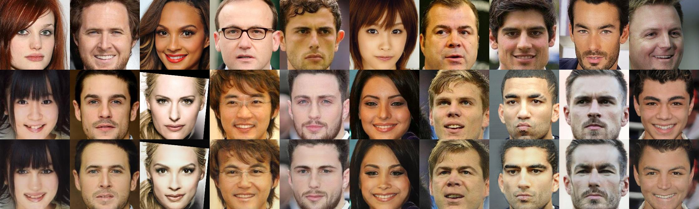

<h1 align="center">
MetaSwap: Towards Elegant One-Shot Face Swapping Framework
</h1>
<p align="center">
    Project of AI2612 Machine Learning Project, 2023 Fall, SJTU
    <br />
    <a href="https://github.com/xxyQwQ"><strong>Xiangyuan Xue</strong></a>
    &nbsp;
    <a href="https://github.com/YsmmsY"><strong>Shengmin Yang</strong></a>
    &nbsp;
    <a href="https://github.com/Ark-ike"><strong>Yi Ai</strong></a>
    <br />
</p>
<p align="center">
    <a href='assets/report.pdf'>  </a>
    <a href="https://github.com/xxyQwQ/metaswap">  </a>
</p>

This is a lightweight implementation of one-shot face swapping model. The framework is designed based on [faceshifter](https://arxiv.org/pdf/1912.13457.pdf) and [simswap](https://arxiv.org/pdf/2106.06340.pdf). The face swapping model mainly supports 224x224 resolution. Some results are shown as follows.




## 🛠️ Requirements

To ensure the code runs correctly, following packages are required:

* `python`
* `hydra`
* `opencv`
* `pytorch`

You can install them following the instructions below.

* Create a new conda environment and activate it:
  
    ```bash
    conda create -n metaswap python=3.10
    conda activate metaswap
    ```

* Install [pytorch](https://pytorch.org/get-started/previous-versions/) with appropriate CUDA version, e.g.
  
    ```bash
    pip install torch==1.12.1+cu113 torchvision==0.13.1+cu113 torchaudio==0.12.1 --extra-index-url https://download.pytorch.org/whl/cu113
    ```

* Install `hydra` and `opencv`:
  
    ```bash
    pip install hydra-core
    pip install opencv-python
    ```

Latest version is recommended for all the packages, but make sure that your CUDA version is compatible with your `pytorch`.

## ⚓ Preparation

In this project, [arcface](https://github.com/TreB1eN/InsightFace_Pytorch) is required for face detection and alignment. Relevant files are already included in the `facial` directory. You should download the pretrained weights [here](https://drive.google.com/file/d/15nZSJ2bAT3m-iCBqP3N_9gld5_EGv4kp/view) and save it as `facial/arcface.pth`.

If you have installed `gdown`, this step can be done by running the following command:
```bash
gdown 15nZSJ2bAT3m-iCBqP3N_9gld5_EGv4kp -O facial/arcface.pth
```

## 🚀 Training

To train the model, `vggface2` dataset is recommended. You can download it [here](https://drive.google.com/file/d/19pWvdEHS-CEG6tW3PdxdtZ5QEymVjImc/view). The directory should contain multiple subdirectories, each of which contains face images with the same identity.

Then modify the configuration file in the `config` directory, where `dataset_path` must be correctly set as the path to your dataset. You can also modify the hyperparameters or create a new configuration file as you like, but remember to modify the `hydra` arguments in `training.py` accordingly.

Here we provide a template configuration file `config/training.yaml`. The batch size is set to 16 by default, which requires at least 16GB GPU memory. Feel free to reduce the batch size if you do not have enough GPU memory.

Run the following command to train the model:

```bash
python training.py
```

## 💡 Inference

We support inference on both images and videos, where videos are processed frame by frame.

The template configuration file `config/inference.yaml` contains necessary arguments for inference. You should correctly set `model_path` as the path to your generator model. Then `source_path` should be the path to your source image which provides the identity, and `target_path` refers to your target image or video. In addition, you should specify `file_type` as either `image` or `video`. The result and temporary files will be saved in the `checkpoint` directory by default, but you can specify it as you like.

You can download the pretrained model [here](https://pan.baidu.com/s/1GFcsw2bZ95aqfCuMh-WYEg?pwd=1024), but training the model by yourself provides better customization.

Run the following command to perform inference:

```bash
python inference.py
```

Since `hydra` allows you to override the arguments in the configuration file in the command line, you can run the following command for image inference:

```bash
python inference.py parameter.source_path=assets/image_1.jpg parameter.target_path=assets/image_2.jpg parameter.file_type=image
```

Similarly, you can run the following command for video inference:

```bash
python inference.py parameter.source_path=assets/image_1.jpg parameter.target_path=assets/video_1.mp4 parameter.file_type=video
```

## 💯 Evaluation

We apply *ID-Retrieval* and *Posture* as the evaluation metrics, which require [arcface](https://github.com/TreB1eN/InsightFace_Pytorch) and [hopenet](https://github.com/natanielruiz/deep-head-pose) respectively. Since `arcface` is already prepared in the former step, you just need to download the pretrained weights for `hopenet` [here](https://drive.google.com/file/d/1m25PrSE7g9D2q2XJVMR6IA7RaCvWSzCR/view) and save it as `facial/hopenet.pth`.

If you have installed `gdown`, this step can be done by running the following command:
```bash
gdown 1m25PrSE7g9D2q2XJVMR6IA7RaCvWSzCR -O facial/hopenet.pth
```

The template configuration file `config/evaluation.yaml` contains necessary arguments for evaluation. You should correctly set `model_path` as the path to your generator model and `dataset_path` as the path to your evaluation dataset. The evaluation dataset should directly contain multiple images with different identities. The metrics and temporary files will be saved in the `checkpoint` directory by default, but you can specify it as you like.

Run the following command to perform evaluation:

```bash
python evaluation.py
```

You can also specify which metrics to use by running the following command:

```bash
python evaluation.py parameter.evaluate_identity=True parameter.evaluate_posture=True
```
