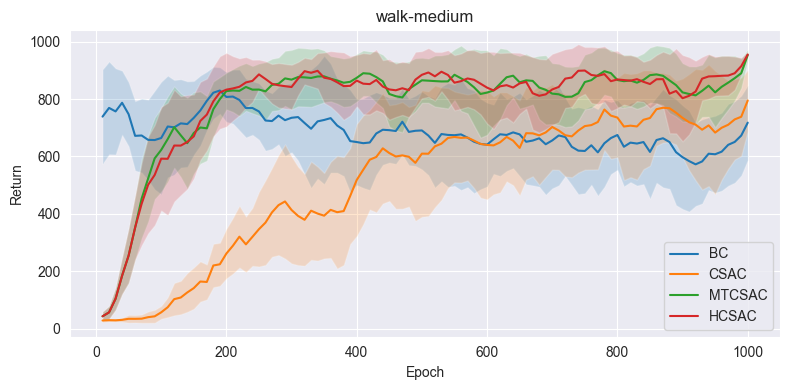
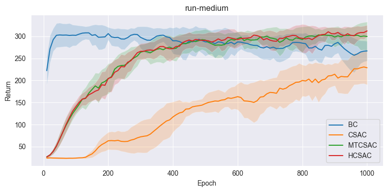

<h1 align="center">
Multi-Task Offline Reinforcement Learning with Heuristic Conservative Soft Actor-Critic
</h1>
<p align="center">
    Project of AI3601 Reinforcement Learning, 2024 Spring, SJTU
    <br />
    <a href="https://github.com/xxyQwQ"><strong>Xiangyuan Xue</strong></a>
    &nbsp;
    <a href="https://github.com/Loping151"><strong>Kailing Wang</strong></a>
    &nbsp;
    <a href="https://github.com/Bujiazi"><strong>Jiazi Bu</strong></a>
    &nbsp;
</p>
<p align="center">
    <a href="https://github.com/xxyQwQ/hcsac">  </a>
    <a href="assets/slides.pdf">  </a>
    <a href='assets/report.pdf'>  </a>
</p>

This project aims to explore the offline multi-task reinforcement learning paradigm. We propose a novel method named heuristic conservative soft actor-critic (HCSAC) based on conservative Q-learning (CQL) and soft actor-critic (SAC) to solve the offline multi-task reinforcement learning problem. We employ task embedding to allow the agent to learn shared representations across multiple tasks. We also follow conservative data sharing (CDS) to utilize heuristic relabeling to augment the offline dataset, so that the agent can benefit from the shared transitions while avoiding performance degradation.

## 🛠️ Requirements

You can install them following the instructions below.

* Create a new conda environment and activate it:
  
    ```bash
    conda create -n hcsac python=3.10
    conda activate hcsac
    ```

* Install [pytorch](https://pytorch.org/get-started/previous-versions/) with appropriate CUDA version, e.g.
  
    ```bash
    pip install torch==1.12.1+cu113 torchvision==0.13.1+cu113 torchaudio==0.12.1 --extra-index-url https://download.pytorch.org/whl/cu113
    ```

* Then install other dependencies:
  
    ```bash
    pip install setuptools==65.5.0 gym==0.21.0 dm_control==1.0.15
    pip install tqdm hydra-core numpy pandas seaborn matplotlib 
    ```

Ensure that your CUDA version is compatible with your `pytorch`. Refer to this [link](https://stackoverflow.com/questions/76129688/why-is-pip-install-gym-failing-with-python-setup-py-egg-info-did-not-run-succ) if you encounter errors when installing `gym`.

## 🚀 Experiments

First, you need to download the given offline dataset and extract it to the `dataset` folder. The dataset consists of offline samples from two tasks (i.e. `walker_run` and `walker_walk`), each including two data quality levels (i.e. `medium` and `medium-replay`). They are collected from the replay buffer when training an online TD3 agent. The `package` folder contains necessary environment specifications for the tasks.

Then you can train the agents with default parameters by running the following commands:

```bash
python bc.py # behavioral cloning
python csac.py # conservative soft actor-critic
python mtcsac.py # multi-task conservative soft actor-critic
python hcsac.py # heuristic conservative soft actor-critic
```

You can specify the task and dataset by modifying the corresponding parameters. For example, to train the HCSAC agent on the `medium-replay` dataset with a batch size of $4096$, you can run the following command:

```bash
python hcsac.py setting.dataset_name=medium-replay strategy.batch_size=4096
```

You can refer to the `config` folder for more configurations and hyperparameters. We write all the experiment commands in the `script` folder. You can reproduce the results in the report by running the following command:

```bash
bash script/run.sh
```

The results and models will be saved in the `checkpoint` folder. You can visualize the training curves and compare the performance of different agents using the provided jupyter notebook `plot.ipynb` in the `script` folder.

## 🎬 Samples

Here are the training curves of the agents in the $4$ settings, including `walk-medium`, `walk-medium-replay`, `run-medium`, and `run-medium-replay`:






Here are the performance comparisons of the agents in terms of the average return in online evaluation:

| Task                 | BC                  | CSAC                | MTCSAC             | HCSAC              |
|:--------------------:|:-------------------:|:-------------------:|:------------------:|:------------------:|
| `walk-medium`        | $551.52 \pm 125.24$ | $653.57 \pm 233.83$ | $870.06 \pm 92.99$ | $907.38 \pm 67.39$ |
| `run-medium`         | $317.26 \pm 9.46$   | $213.67 \pm 49.56$  | $306.16 \pm 20.43$ | $308.38 \pm 7.64$  |
| `walk-medium-replay` | $829.63 \pm 74.64$  | $812.80 \pm 146.82$ | $931.37 \pm 9.21$  | $927.43 \pm 14.76$ |
| `run-medium-replay`  | $244.80 \pm 33.35$  | $234.81 \pm 22.11$  | $254.31 \pm 11.60$ | $256.79 \pm 10.13$ |

See the project report for more experiment details and explanations.
