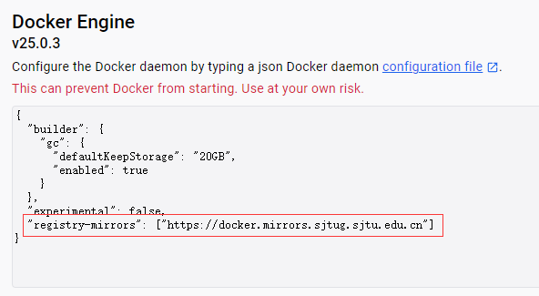
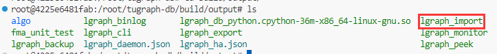
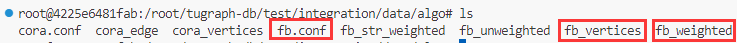
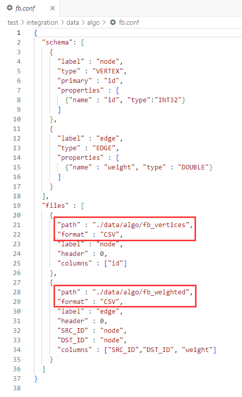
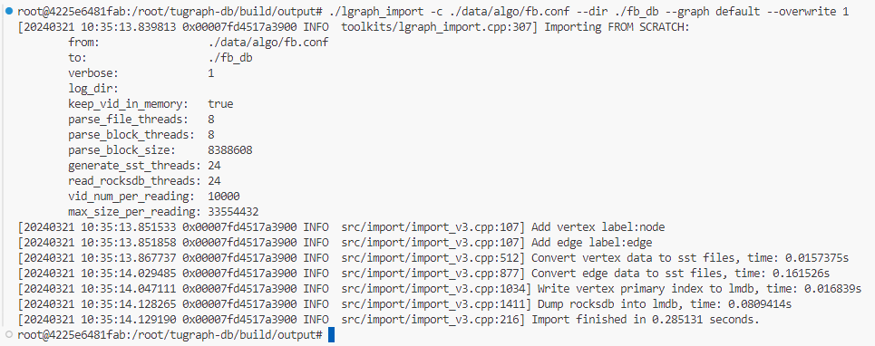
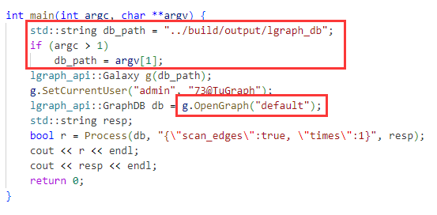

# Programming Assignment 2 Phase 1 - TuGraph

> TA Contact: Borui Yang, Hangyu Ye  
> E-mail: ybirua@sjtu.edu.cn, hangyu_ye@outlook.com

## Contents

1. [Introduction](#1-introduction)
2. [Tasks for This Assignment](#2-tasks)
3. [Submission and Grading](#3-submission--grading)

## 1. Introduction

**Homework 2 will focus on data mining algorithms on graph data structures.** Throughout HW2 we will be using **[TuGraph](https://tugraph.tech/)**, a graph database developed by Ant Group, as the supporting infrastructure. TuGraph provides a graph database engine for querying and updating graph databases via transactions, as well as built-in graph analytic algorithms for efficient graph data analysis. TuGraph currently provides APIs for C++ and Python. The programming assignments in HW2 will primarily use the Python APIs.

Phase 1 of Homework 2 (HW2-P1) will be more like a tutorial (rather than an actual "assignment"). **This programming assignment does *NOT* count toward your final score.** Instead it is designed to hopefully walk you through the fundamentals of setting up TuGraph and using it for development, so that you could be ready for the upcoming programming assignments.

Please note that, since TuGraph is still under active development, there are some subtle "features" that make using TuGraph a little bit tricky. Therefore, **please follow the steps in the [Task section](#2-tasks) carefully**. Should you encounter any problem, please feel free to contact the TAs.

**No actual programming is required in HW2-P1. However, you will need to execute some code/programs,** mainly to verify that you have set up your environment correctly.

:information_source: You can refer to the files under `docs/` directory for more documentation. A Chinese tutorial on TuGraph is also available (`docs/TuGraph教学.pptx`).

## 2. Tasks

1. [Setting up a docker container](#21-setting-up-your-docker)
2. [Creating a Python 3.6 environment](#22-creating-a-python-36-environment)
3. [Importing data to TuGraph DB](#23-importing-data-as-tugraph-db)
4. [Running built-in algorithms](#24-running-a-built-in-weighted-pagerank)
5. [Writing Python programs with TuGraph APIs](#25-writing-python-programs-with-tugraph-apis)

### 2.1. Setting Up Your Docker

The recommended way of deploying TuGraph is through [Docker](https://www.docker.com/).

1. If you have access to a linux server with docker installed, you could use it directly.
2. Alternatively, Windows and MacOS users could consider [Docker Desktop](https://www.docker.com/products/docker-desktop/).
   - **Note.** Windows users might need to [enable Hyper-V](https://learn.microsoft.com/zh-cn/virtualization/hyper-v-on-windows/quick-start/enable-hyper-v) for Docker Desktop to run properly. Please refer to [this post on StackOverflow](https://stackoverflow.com/questions/39684974/docker-for-windows-error-hardware-assisted-virtualization-and-data-execution-p) should you encounter any issue.
3. As a last resort, if previous methods have failed, you could try using a Linux virtual machine (e.g., Ubuntu with VirtualBox), and then install docker in the virtual machine, and then pull the image using the docker in your virtual machine.
   - **Note.** This is NOT recommended and should only be used if previous methods do not work. If you were to follow this approach, please allocate adequate resources to your virtual machine (preferably 4+ CPUs, 8GB+ memory and 50GB+ disk space).
   - If you do need to use a virtual machine, please follow the instructions in `docs/tugraph-vm.md`.

#### 2.1.1. Pulling the Image

TuGraph is developed in C++, and requires to be compiled before use. For ease of your deployment, we provide a docker image that contains a compiled TuGraph database and a pre-installed conda environment. The image is named `ybrua/ai3602-tugraph-centos7` and is available on Docker Hub. Pull the image by

```sh
# NOTE: For Docker Desktop, you need to START Docker Desktop before executing this command.
docker pull ybrua/ai3602-tugraph-centos7:latest
```

:warning: **ALERT.** The image `ybrua/ai3602-tugraph-centos7` has a size of around **25GB**. Please ensure you have enough disk space before pulling the image to your device.

If you have connection issues with Docker Hub, try following the steps in [Section 2.2.1(b)](#211b-alternatives-for-pulling-the-image) below.

#### 2.1.1b. Alternatives for Pulling the Image

> If you fail to pull the image due to connection issues with Docker Hub, you can try the two alternatives listed below.

**Alternative#1 Using SJTUG's mirror for docker registry.** [SJTUG](https://mirrors.sjtug.sjtu.edu.cn/) provides a mirror for Docker Hub, which should be more stable than pulling directly from Docker Hub. **To setup this mirror, follow the official instructions ([available at this link](https://mirrors.sjtug.sjtu.edu.cn/docs/docker-registry))**. (You might need to `sudo systemctl restart docker` for the changes to take effect).

For Docker Desktop users, please start Docker Desktop and open its settings. You will be able to find a config under `Settings -> Docker Engine`. Add `"registry-mirrors": ["https://docker.mirrors.sjtug.sjtu.edu.cn"]` to the JSON configuration, as is shown in the image below.



Apply the changes and restart your Docker Desktop for it to take effect.

**Alternative#2 Downloading image from jbox.** You can also download the image from [jbox](https://jbox.sjtu.edu.cn/l/z16Kjy). After downloading the `.tar` file, load it into your docker by

```sh
docker load -i path/to/the/downloaded/tar/file
```

#### 2.1.2. Starting a Container

After successfully pulling (or loading) the image, start a docker container by

```sh
docker run -it -d -p 7070:7070 -v C:/somewhere:/root/ai3602 --name tugraph-ai3602 ybrua/ai3602-tugraph-centos7:latest /bin/bash
```

- The `-v src:dst` parameter is used for mounting a storage on your device to the docker container.
  - For example, `-v C:/somewhere:/root/ai3602` means mounting the directory `C:/somewhere` to `/root/ai3602` on the container.
  - Once you have entered the docker, you should be able to see the files that are in `C:/somewhere` under `/root/ai3602`.
- The `-n tugraph-ai3602` refers to the name of the started docker container. You can refer to this container by `tugraph-ai3602` after starting it.

This will start the docker in *detached* mode. The docker container will run in background. You can check the status with `docker ps` or `docker ps -a`.

```sh
(base) borui@ubun:~$ docker ps
CONTAINER ID   IMAGE                                 COMMAND       CREATED       STATUS       PORTS                                       NAMES
f4e84a948524   ybrua/ai3602-tugraph-centos7:latest   "/bin/bash"   4 hours ago   Up 4 hours   0.0.0.0:7070->7070/tcp, :::7070->7070/tcp   tugraph-ai3602
```

#### 2.1.3. Connecting to the Container

When your container is running,

```sh
# docker exec [OPTIONS] <container_id> <cmd>
# docker exec [OPTIONS] <container_name> <cmd>
docker exec -it tugraph-ai3602 bash
```

- The command means executing a `bash` command in the docker in interactive mode.
- You can use either use the name `tugraph-ai3602` or the container id (`f4e84a948524`, see the output of `docker ps` above).

This will get you into your docker. If you have followed the steps above, you should be able to see something like this.

```sh
# Execute this line in Windows terminal
(base) PS C:\borui\Affairs\TA\24SP-AI3602> docker exec -it tugraph-ai3602 bash

# Enters the docker container. Note the prompt changes into "[root@45a3bc19602f ~]#"
# ai3602 is my mounted directory. tugraph-db is the compiled TuGraph database
(base) [root@45a3bc19602f ~]# ls
ai3602  anaconda-ks.cfg  tugraph-db
```

#### 2.1.4. Some Other Docker Commands

> Suggested reading: [Docker Cheat Sheet](https://docs.docker.com/get-started/docker_cheatsheet.pdf) | [Docker 命令大全](https://www.runoob.com/docker/docker-command-manual.html).

:point_right: You can **stop a docker container** by

```sh
# docker stop <container_id_or_name>
docker stop tugraph-ai3602
```

This can (imprecisely) be interpreted as "shutting down the computer" for the docker container.

:point_right: You can **re-start a stopped docker container** (i.e., "turn on the computer") by

```sh
# docker start <container_id_or_name>
docker start tugraph-ai3602
```

:point_right: You can also **remove the docker container** by

```sh
docker rm tugraph-ai3602
```

:information_source: **Note** The container must be **stopped** before removing it.

:warning:**ALERT.** Removing the docker container means "permanently deleting it". Any changes you have made to the container WILL BE LOST. **It is suggested that you keep your container until this semester ends, or at least until HW2 finishes.**

#### 2.1.5. Notes

1. The image has been tested on (1) An Ubuntu 20.04 server, (2) Docker Desktop on Windows 11 (with WSL2 backend) and (3) An Ubuntu 22.04 VM running on Virtual Box. If the provided image does not work on your machine, try following `docs/docker-tugraph.md` for some alternative approaches.
2. **Visual Studio Code** is suggested for development within the docker container. Refer to `docs/docker-vscode.md` for tutorials.
3. If you want the command prompt in your container to show current work directory, you can add `PS1='$(whoami)@$(hostname):$(pwd)# '` this line to the `.bashrc` file under `/root` and reload with `source .bashrc`. In this way your prompt should look like `root@6caf1d3385ed:/root#`.

### 2.2. Creating a Python 3.6 Environment

**The TuGraph database is compiled with Python 3.6, and it will only work with Python 3.6.** Therefore the next step is to setup a Python 3.6 environment. You can use any method you prefer. The following tutorial will use Miniconda, which has been installed in the provided image.

```sh
(base) [root@45a3bc19602f ~] conda create -n tugraph -y Python=3.6
(base) [root@45a3bc19602f ~] conda activate tugraph
# note the prefix changed into tugraph
(tugraph) [root@45a3bc19602f ~]
```

:warning: **Note that you must use Python 3.6 for TuGraph and your code to work properly.** After setting up this environment, you can install any package you need.

### 2.3. Importing Data as TuGraph DB

> The compiled binaries for TuGraph can be found under `tugraph-db/build/outputs/` directory.

We need to first **import data into TuGraph** before using it. This can be done with the `lgraph_import` executable. `lgraph_import` can be found under `tugraph-db/build/outputs/`.



Some sample data files are provided in `tugraph-db/test/integration/data/algo`. We will use the `fb` graph as an example,



Importing with `lgraph_import` requires three files. (1) The config `*.conf`, (2) The edges (csv or json), and (3) The vertices (csv or json), which are highlighted in the screenshot above.

:warning: TuGraph by default treats graphs as **directed** ones. If you were to import an undirected graph, the edge csv file should contain both directions (i.e., both `src, dst` and `dst, src` for one undirected edge).

#### 2.3.1. A Deeper Dive into The Config

We will use `fb.conf` as an example to illustrate the format of this config file.



The config file specifies the **schema** of the database and the **path to vertex and edge files**. Note that in this example, the path to files are **relative paths**. It is **relative to `tugraph-db/build/outputs`** (i.e., the directory of `lgraph_import`). Therefore we either need to make sure the relative path is correct, or use an absolute path instead.

- The vertex and edge files must be in the correct format, according to the schema.
- The `header = 0` entry means the csv file does not contain a header.

:information_source: **You do NOT need to know how to write a config file. We will provide necessary config and data files in the upcoming releases of HW2.** However, you need know how to import the data. It is also encouraged to get yourself familiar with the config in case you need to debug it, or you plan to use it in the future (such as in the open final project).

#### 2.3.2. Importing Data

Since `fb.conf` uses relative paths for vertex and edge files, we will need to move the files to `tugraph-db/build/outputs` for `lgraph_import` to find the relevant files correctly.

Follow the steps below

```sh
# goto the directory where lgraph_import is
cd /root/tugraph-db/build/output
# copy the data files to current directory
# in this way the data files will be stored in the correct position relative to lgraph_import
cp -r ../../test/integration/data/ ./
```

Then invoke `lgraph_import` by

```sh
./lgraph_import \
    -c ./data/algo/fb.conf \ # path to the config file
    --dir ./fb_db          \ # path to store the database
    --graph default        \ # name of current graph, use "default" for compatibility with TuGraph's built-in algos
    --overwrite 1            # overwrite existing files 
```

The expected output should be like this



And you will be able to find `fb_db/` directory under `output/`.

### 2.4. Running a Built-in Weighted PageRank

TuGraph provides 6 base algorithms and 28 extensions, all of which are implemented with C++. The source code could be found under `tugraph-db/procedures/algo_cpp/` directory.

We now run the Weighted Page Rank algorithm on the `fb_db` database we have just imported.

The driver for the algorithms is the `embed_main.cpp` under `tugraph-db/procedures/` directory. The source code for `embed_main.cpp` is as follows



- The program (after compile) accepts an optional commandline argument `db_path` that points to the path to the database.
- The program by default loads the graph `default` from the database.

To actually run the algorithms, we need to first compile them. Go to `tugraph-db/build/` directory and execute the following commands

The algorithms are named in the format of `<algo_name>_embed`, you can use the `make` command to compile designated algorithms. Here we are using `wpagerank`, so we should run `make wpagerank_embed`.

```sh
# goto build directory
cd /root/tugraph-db/build

# compile the algorithm, algorithms are named as <algo_name>_embed
make wpagerank_embed
>>>> [ 88%] Built target lgraph
>>>> [100%] Built target wpagerank_embed

# the compiled file is available in tugraph-db/build/output/algo
# execute the program by providing it with the database path
cd output
./algo/wpagerank_embed ./fb_db
```

You should get a result that looks like

```json
{
    "core_cost":0.062013864517211914,
    "max_wpr_value":0.0045248161420893525,
    "max_wpr_vi":1911,
    "num_edges":88234,
    "num_vertices":4039,
    "output_cost":0.0,
    "prepare_cost":0.035140275955200195,
    "total_cost":0.09715414047241211
}
```

The algorithm runs a weighted PageRank algorithm on the given graph, and outputs the node with the highest weight.

### 2.5. Writing Python Programs with TuGraph APIs

TuGraph provides a set of Python APIs for querying and updating graph databases. An official document is available [at this link](https://tugraph-db.readthedocs.io/en/latest/5.developer-manual/6.interface/3.procedure/4.Python-procedure.html). We have also prepared a cheat sheet listing some APIs you might need in the upcoming assignments. Please refer to `./docs/tugraph-py-api.md`.

#### 2.5.1. A Sample Program

We have prepared a sample python program (`p1_main.py` and `bfs.py`), which finds a shortest path between two nodes with breadth-first search. The entry point of the program is `p1_main.py`.

The logic of `p1_main.py` is as follows

1. It opens a `Galaxy` (a set of `GraphDB` instances) and logs in with the provided username and password.
2. It opens the `default` database from the galaxy.
3. It invokes `bfs_path_search` on the database to search for shortest paths.
4. In `bfs_path_search` we create a `Transaction` with `db.CreateReadTxn()` to query vertex and edge information from the database. The queries are done via the APIs provided by the `Transaction` class.

Please note that

- **The Python program is already complete.** You do not need to modify anything.
- The Python APIs are packaged in `liblgraph_python_api.so`, which can be found under `tugraph-db/build/output/`.

#### 2.5.2. Importing the sample data

The sample python program runs on a simple graph with 10 nodes and 17 edges. We have prepared the config file and the data csv files under `./p1_data/` directory. You need to convert them into a TuGraph database.

We have listed the steps for importing data in [Section 2.3](#23-importing-data-as-tugraph-db). Just for emphasizing, we re-iterate the process,

```sh
# !!! execute these commands under
# !!! /root/tugraph-db/build/output
cd /root/tugraph-db/build/output

# copy the data into /root/tugraph-db/build/outputs, where lgraph_import is located.
# You should be able to find a copied p1_data directory under build/output/
# after executing this line of command
# NOTE: You might need to change the source path according to your workdir
cp -r /root/ai3602/p1_TuGraph/p1_data/ ./

# use lgraph_import to import the graph
./lgraph_import -c ./p1_data/p1.conf --dir ./p1_db --graph default --overwrite 1
```

#### 2.5.3. Running the Python Sample

Since the Python APIs are wrapped in `liblgraph_python_api.so` under `tugraph-db/build/output/`, **you need to put `p1_main.py` (which imports `liblgraph_python_api`) under `tugraph-db/build/output/` so that it could import the library correctly.**

The suggested way is to create a **symbolic link** between the main function under this directory and `tugraph-db/build/output/`,

```sh
# create a symbolic link of p1_main.py under tugraph-db/build/output/
# NOTE: this command need to be executed under tugraph-db/build/output/
# NOTE: You might need to change the source path according to your workdir
ln -s /root/ai3602/p1_TuGraph/p1_main.py ./p1_main.py
```

In this way you will create a soft link for the main file under `tugraph-db/build/output`. Any changes you have made to the main file will be automatically synchronized.

Then you can execute the file **under `tugraph-db/build/output`**.

```py
# NOTE: Use a Python 3.6 environment!
conda activate tugraph
# NOTE: Run Python under tugraph-db/build/output!
python p1_main.py
```

The expected output should be

```sh
(tugraph) [root@f4e84a948524 output]# python p1_main.py 
Loading DB state from disk
(src) 0 -> 1 -> 2 -> 3 (dst)
(src) 0 -> 4 -> 5 -> 6 (dst)
(src) 0 -> 8 -> 7 -> 9 (dst)
```

## 3. Submission & Grading

**This programming assignment does *NOT* require a submission.** However, since the process of setting up TuGraph's environment could be a bit tedious, and you will soon need to use TuGraph in the upcoming assignments, **it is *strongly recommended* that you actually go through the process of setting up the environment, *as soon as possible*.**

**This programming assignment does *NOT* count toward your final score.**

## Notes

- Should you have any question, issue or suggestion, please do not hesitate to contact the TAs.
- You are encouraged (but not required) to use TuGraph in your final project, if you choose graph-related topics.
