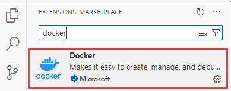
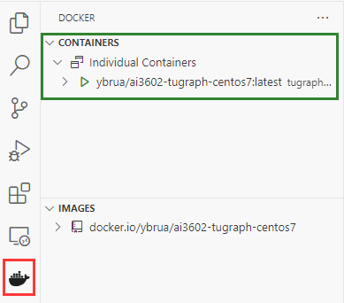
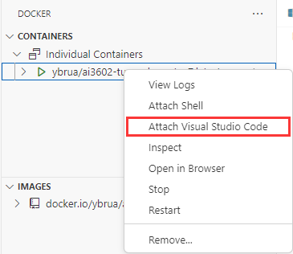
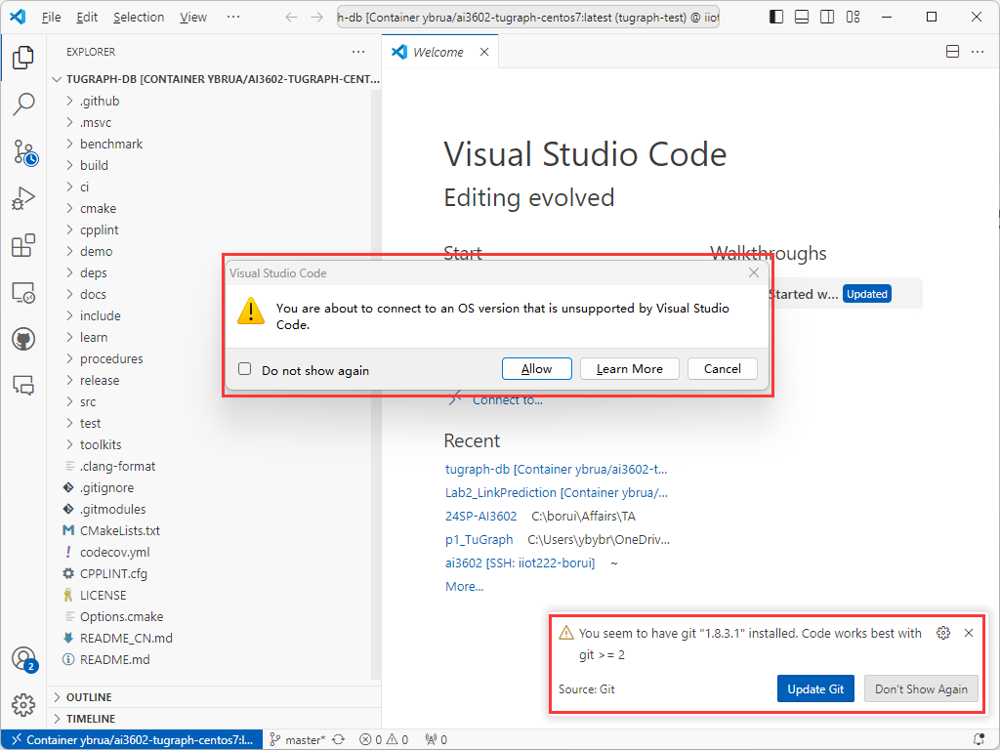

# Docker Development with Visual Studio Code

Visual Studio Code is recommended for working with docker containers.

First, install the Docker extension from the extension marketplace.

After installing the plugin, you should be able to see a **docker icon** (marked in red) on the panel of your Visual Studio Code.

The **container panel** (marked in green) shows a list of all docker containers. Note that a container of our image `ai3602-tugraph-centos7` is currently running.

Right click the container and select `Attack Visual Studio Code`.

This will start a new Visual Studio Code window.

Note that VS Code warns that the OS version (CentOS 7) is not supported by VS Code. This is normal. You can simply click `Allow` and ignore this warning.

Another warning on the bottom right suggests that git can be updated. You can also ignore this one.

You are all set. You can now access the files within this container using VS Code. You can open folders, browse files and write your code in the same way as you would do on your own PC. However, you might still need to manually install some other extensions (e.g., the extension for Python) in the VS Code in your container.
