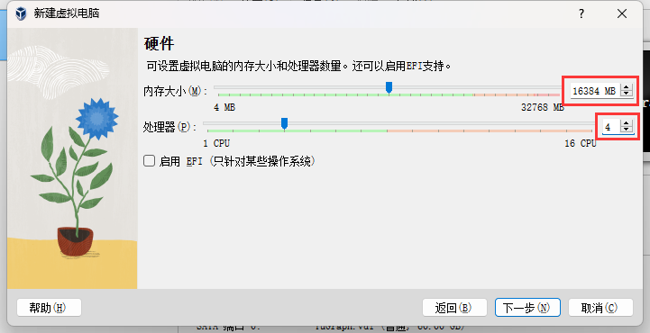

# Setting Up Your Docker in Linux Virtual Machine

**Note.** This method is not recommended because it is less convenient than directly using a linux server or a Windows system with Docker Desktop. However, if you do not have access to linux servers, and you cannot install or launch Docker Desktop on your machine for some reason, you can consider this as your last resort.

In this tutorial we will use [Virtual Box](https://www.virtualbox.org/) and [Ubuntu](https://ubuntu.com/).

We assume you have a Virtual Box installed on your machine.

## 1. Create a Ubuntu VM

1. Download Ubuntu 22.04 LTS (Jammy Jellyfish). You can find the image [at this link](https://releases.ubuntu.com/jammy/).
2. Start Virtual Box. Create a new virtual machine. Select `Ubuntu 22.04 (Jammy Jellyfish)` as its version.
   
3. Allocate memory and CPU. Note that you should provide adequate hardware resources.
   
4. Allocate disk space for your VM. We recommend 50GB+ so that your disk can hold Ubuntu itself and the docker image (25GB). In this example we allocate 75GB, just in case.
   
5. After creating this VM, start it with Virtual box.
   
6. If this is the first time you start this virtual machine, it will prompt you to select an image for installing the OS. Select the Ubuntu 22.04 image you have just downloaded in step 1.
7. Follow the instructions in your Ubuntu VM to complete the install of Ubuntu.

## 2. Installing Docker on Your VM

After setting up the VM, you need to install docker on it. You can find instructions for installing docker [from its official website](https://docs.docker.com/engine/install/ubuntu/).

In short, you need to open up a terminal in your VM and execute the following commands.

```sh
# remove conflicting packages
# for a brand-new vm this step is unnecessary
# but we will do it anyway, just in case
for pkg in docker.io docker-doc docker-compose docker-compose-v2 podman-docker containerd runc; do sudo apt-get remove $pkg; done
```

```sh
# Setup Docker's apt repository

# Add Docker's official GPG key:
sudo apt-get update
sudo apt-get install ca-certificates curl
sudo install -m 0755 -d /etc/apt/keyrings
sudo curl -fsSL https://download.docker.com/linux/ubuntu/gpg -o /etc/apt/keyrings/docker.asc
sudo chmod a+r /etc/apt/keyrings/docker.asc

# Add the repository to Apt sources:
echo \
  "deb [arch=$(dpkg --print-architecture) signed-by=/etc/apt/keyrings/docker.asc] https://download.docker.com/linux/ubuntu \
  $(. /etc/os-release && echo "$VERSION_CODENAME") stable" | \
  sudo tee /etc/apt/sources.list.d/docker.list > /dev/null
sudo apt-get update
```

```sh
# Install docker
sudo apt-get install docker-ce docker-ce-cli containerd.io docker-buildx-plugin docker-compose-plugin
```

## 3. Starting Docker

After installing, start docker daemon by

```sh
sudo usermod -aG docker $USER
sudo systemctl start docker
```

Then you can verify your docker installation by running a small image

```sh
sudo docker run hello-world
```

If this image runs successfully, then you can then pull our docker image using `docker pull` command.

## 4. Troubleshooting

If you have followed the steps above but running `hello-world` results in an error (something like `request returned Internal Server Error...`), then try the steps below.

```sh
sudo systemctl restart docker
sudo chmod 666 /var/run/docker.sock
```

Then try running `hellow-world` again.
