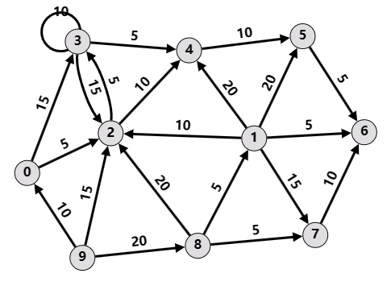

# Programming Assignment 2 Phase 2 - Louvain

## 1. Introduction

In this assignment, you are required to implement the Louvain algorithm for community detection. This project consists of **4 progressive tasks**. You will first compile and run TuGraph's built-in Louvain algorithm, and then implement the Louvain algorithm in Python. We have provided the driver code and a scaffolding, and you need to fill in the key components.

### 1.1. Dataset

You are given a **directed citation network** with 31,136 nodes and 220,325 edges, where the direction of the directed edge represents the citation relationship between papers. The papers come from 5 conferences (AAAI, IJCAI, CVPR, ICCV and ICML) and are labeled from 0 to 4 respectively. Your task is to **implement the Louvain algorithm to divide the papers into 5 communities**.

The data files include

1. `./p2_data/p2.conf`, `./p2_data/p2_vertices.csv`, `./p2_data/p2_edges.csv`. These 3 files are the actual dataset. You need to convert them into a TuGraph database (See [Task 1](#21-using-tugraphs-built-in-louvain-algorithm-10)).
2. `test_graph.csv`. This is a small weighted directed graph with 10 nodes. This graph is used for testing your implementation of modularity calculation (See [Task 3](#23-computing-modularity-20)).
3. `label_reference.csv`. This csv file contains 300 ground truths as a reference. You can use this file to merge extra communities (See [Task 4](#24-implementing-louvain-algorithm-60)) and test your algorithm.

### 1.2. Environment

**TuGraph is required for this project.** You can refer to the documentations in HW2 Phase 1 for setting up the docker container for TuGraph.

**Python 3.6 is required for this project.** By default, this project does not require any additional Python packages, but you are free to include other packages as you wish. However, **do NOT use existing community detection APIs**, such as those from `networkx`.

## 2. Task

### 2.1. Using TuGraph's Built-in Louvain Algorithm (10%)

> Related Files: `import_data.sh`.  
> Related TuGraph Built-ins: `louvain_embed` (To be compiled under `/root/tugraph-db/build/`).

The first step is to import the database and try out the built-in algorithm provided by TuGraph.

1. **Convert the provided graph data into a TuGraph DB.**
   - We have provided the data in the format required by `lgraph_import`. Relevant files are available under the `p2_data/` directory.
   - You need to use `lgraph_import` to create a database under `/root/tugraph-db/build/outputs/`. The directory of the database should be `/root/tugraph-db/build/outputs/p2_db` and the name of the graph should be `default`.
   - We have provided a shell script `import_data.sh` for your reference.
2. **Run the built-in Louvain algorithm on the imported graph DB.**
   - Compile and run `louvain_embed`. Recall that we have run `wpagerank_embed` in Phase 1. The steps for compiling and running `louvain_embed` are similar.
   - **You need to take a screenshot of the built-in Louvain's result.** The result might contain more than 5 communities (typically it would contain around 15 communities). **Include your screenshot in your submission (see [Section 3.1. Submission](#31-submission)).**

### 2.2. Reading Data from TuGraph (10%)

> Related Files: `tugraph_process.py`.

Then we move on to the actual Python implementation of hhe Louvain algorithm.

Since the Louvain algorithm requires iteratively merging and updating the graph, it would be easier if we load the entire graph into main memory. Therefore, we will only use TuGraph for reading data. Note that loading the entire graph into main memory might not be always feasible, but we will do it anyway because our dataset is not that large.

1. **Implement the `read_from_tugraph_db()` function in `tugraph_process.py`**.
   - Refer to the comments in the code for more instructions and hints.
   - You will need to use some of TuGraph's Python APIs. **A cheat sheet is available at `docs/tugraph-py-api.md`**.

### 2.3. Computing Modularity (20%)

> Related Files: `community.py`, `louvain.py`, `test_modularity.py`.

The Louvain methods requires computing modularity gains of adding/removing nodes into/out of communities.

:warning: The graph in this assignment is a **directed graph**. **For directed graphs, you should use the formulas below**

$$ Q_d(i \to C) = \frac{k_{i,in}}{m} - \frac{\left( k_i^{in}\cdot\Sigma_{tot}^{out} + k_i^{out}\cdot\Sigma_{tot}^{in} \right)}{m^2} $$

$$ Q_d(D \to i) = -Q_d(i \to D) = -\frac{k_{i,in}}{m} + \frac{\left( k_i^{in}\cdot\Sigma_{tot}^{out} + k_i^{out}\cdot\Sigma_{tot}^{in} \right)}{m^2} $$

where

- $k_{i,in}$ is the sum of weights of links between node $i$ and nodes in community $C$, including *both in-edges and out-edges*,
- $m$ is the sum of weights of all edges in the graph,
- $k_i^{in}, k_i^{out}$ is the in-degree and out-degree of node $i$ respectively,
- $\Sigma_{tot}^{in}, \Sigma_{tot}^{out}$ are the sum of all in-degrees and out-degrees of nodes in community $C$.

You are required to

1. **Implement the functions `add_node()` and `remove_node()` in the `Community` class (in `community.py`).** These two functions should update $\Sigma_{tot}^{in}$ and $\Sigma_{tot}^{out}$ whenever a node is added or removed from the community.
2. **Implement the functions `node2comm_in_degree()` and `node2comm_out_degree()` in the `Community` class (in `community.py`).** These two functions together would be used to compute $k_{i,in}$.
3. **Implement the `delta_modularity()` function in the `Louvain` class (in `louvain.py`).** This function should compute $\Delta Q_d(i \to C)$. Note that $\Delta Q_d(D \to i)$ can be computed similarly by $\Delta Q_d(D \to i) = -\Delta Q_d(i \to D)$.
4. (*Optional, but recommended*) **Add more test cases to `test_modularity.py` to verify the correctness of your modularity computation**. We have provided some BASIC unit tests in `test_modularity.py` as templates and examples. It is recommended (although not mandatory) that you should add more test cases.

Refer to the comments in the source code for more instructions and hints.

#### More on Unit Tests

We use Python's built-in unit test framework (`unittest`) to verify the correctness of your modularity computation.

The unit test uses a simple weighted directed graph (defined in `p2_data/test_graph.csv`). The graph is illustrated in the figure below.



The unit tests can be executed by

```plaintext
>>>> python .\test_modularity.py
..........
----------------------------------------------------------------------
Ran 10 tests in 0.001s

OK
```

If the functions (and your unit tests) are correctly implemented, you should be able to pass all tests and see an output similar to the one above.

:warning: We reiterate that the provided test cases MIGHT NOT BE SUFFICIENT to fully verify the correctness of your implementation. **It is recommended (although not required) that you should add more test cases in `test_modularity.py`**. Nonetheless, this task is optional, and you can safely skip it if you are confident with your implementation. Your test cases do not count toward your final score (but the correctness of your algorithm does!).

### 2.4. Implementing Louvain Algorithm (60%)

> Related files: `louvain.py`, `p2_main.py`, `run.sh`.

Finally you will need to implement the main body of the Louvain algorithm.

1. **Complete the missing parts marked with `TODO`s in `phase1()` and `phase2()` of the `Louvain` class (in `louvain.py`).** Please refer to the comments in the TODO section for detailed instructions.
2. **Complete the `merge_communities()` method of the `Louvain` class.** In this assignment we expect 5 communities at the end. However, the Louvain algorithm typically ends up with more than 5 communities. Hence, you need to **come up with some ways to merge the extra communities**.
   - We have provided 300 ground truth labels in `label_reference.csv`. You could use these 300 labels to your advantage when merging the communities.
   - You could also explore other ways of merging extra communities. Refer to the comments in the source code for more information.

To run your algorithm, create a **symbolic link** of `p2_main.py` under `/root/tugraph-db/build/output/` and run `p2_main.py` under `/root/tugraph-db/build/output/`.

We have provided a script `run.sh` for ease of running your script.

```sh
# This should automatically create a symbolic link and run your p2_main.py
source run.sh
# or bash run.sh
```

## 3. Submission & Requirements

### 3.1. Submission

The provided code will automatically produce a `p2_prediction.csv` under `./p2_data`.

Submit your results and all source code as a ZIP file, named as `[StudentID]_[ChineseName]_HW2P2.zip` (e.g., `521030910000_张三_HW2P2.zip`). The following files are REQUIRED in your submission.

```txt
523030910000_张三_HW2P2/
├─ p2_data/
│  ├─ p2_prediction.csv   # predictions of your algorithm
├─ tugraph-output.png     # screenshot of built-in louvain
├─ *.py                   # ALL related source code files
├─ run.sh                 # The script for running the project
```

The TAs will run you code by

```sh
# NOTE: we will use an unreleased version of `test_modularity.py` with additional test cases
#       but we will use YOUR `run.sh` to reproduce your results
python test_modularity.py  # For grading Task 3
bash run.sh                # For reproducing Task 4
```

**Please ensure:** (1) Your submission is self-contained, i.e., it contains all necessary Python files for your project to run. (2) Your `run.sh` contains the required commandline arguments (if any) for the TAs to reproduce your results.

### 3.2. Requirements

1. **Do NOT use any existing community detection APIs.** You can use any additional Python packages, but no direct calls to community detection (or modularity calculation) APIs are allowed.
2. **You are REQUIRED to load data from TuGraph databases.** Do NOT read data directly from csv files.
3. **Do NOT change the following files: `p2_main.py`, `import_data.sh`.** These files will be used for automated grading. Contact the TAs in advance if you do need to change these files.
4. **Other than the files above, you can freely change any of the remaining files.** You can also add new files or remove unused files if you wish. However, please ensure your submission is self-contained.
5. **Do NOT directly copy others' code,** whether from your classmates, previous years' solutions, GitHub or generative AIs. If you refer to other's implementations, you need to explicitly acknowledge the source.
6. **Ensure that your code is runnable and reproducible.** We will run your code and verify the results. A penalty will be imposed on your final score if there is a significant gap between your reported results and our reproduced ones.

### 3.3. Other Notes

1. **We have provided a few data structures to facilitate your development (e.g., `WeightedDiGraph`, `Community`, etc.).** Read their docstrings and use them to your advantage. You can make modifications to these data structures, or create your own ones if you find the provided interfaces unable to meet your needs (though not recommended, since the workload could be high).
2. **You do not need to worry about the ordering of labels.** Our grading script will automatically resolve the *best possible* accuracy.
3. **You are encouraged (but not required) to follow good programming habits**. E.g., use meaningful variable names, write comments where necessary, avoid extremely long lines, etc. This, however, will not affect your score.

## 4. Grading

Each part will be graded independently.

#### 4.1. Using TuGraph's Built-in Louvain Algorithm (10%)

- Full 10% if you provided the screenshot with the expected output of TuGraph's Louvain method.

#### 4.2. Reading Data from TuGraph (10%)

- Full 10% if your code correctly loads data from TuGraph database.
- A deduction will follow if your code does not use TuGraph, even if your Louvain algorithm is correctly implemented.

#### 4.3. Computing Modularity (20%)

- We have prepared additional test cases (not released) to test your modularity computation.
- The score will be given according to the results of our test cases. Full 20% if your code passes all our test cases, and deducted proportionally if some cases fail.
- **Note.** Your own test cases will NOT be used for grading, and they do NOT count toward your final score.

#### 4.4. Implementing Louvain Method (60%)

The score for your implementation will be given according to the following metric.

|                           Metrics                           | Score (for this part) |
| :---------------------------------------------------------: | :-------------------: |
| Code runs without error. 5 communities. Accuracy above 70%. |         100%          |
| Code runs without error. 5 communities. Accuracy above 60%. |      90% - 100%       |
| Code runs without error. 5 communities. Accuracy above 50%. |       80% - 90%       |
| Code runs without error. 5 communities. Accuracy above 20%. |       60% - 80%       |
|         Code runs without error. 5-20 communities.          |          60%          |
|                        Other cases.                         |   Manually scored.    |

For your information,

- If you have implemented the core Louvain method correctly (without merging them into 5 communities), it should be able to detect around 15 communities.
- The TA's implementation has achieved a final accuracy of 73%.

## References

1. V. D. Blondel, J.-L. Guillaume, R. Lambiotte, and E. Lefebvre, ‘Fast unfolding of communities in large networks’, Journal of statistical mechanics: theory and experiment, vol. 2008, no. 10, p. P10008, 2008.
2. N. Dugué and A. Perez, ‘Directed Louvain: maximizing modularity in directed networks’, Université d’Orléans, 2015.
3. [Networkx Documentation: `networkx.communities.modularity()`](https://networkx.org/documentation/stable/reference/algorithms/generated/networkx.algorithms.community.quality.modularity.html).
4. [Networkx Documentation: `networkx.communities.louvain_communities()`](https://networkx.org/documentation/stable/reference/algorithms/generated/networkx.algorithms.community.louvain.louvain_communities.html).

**Note.** The documentation of `networkx` APIs contain useful information and insights on the Louvain algorithm, which you can use as a source of reference. However, you are NOT ALLOWED to directly call the two APIs above in your main Louvain implementation.
