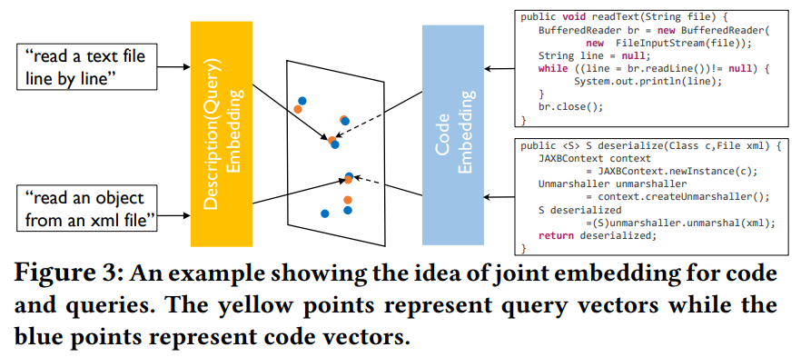
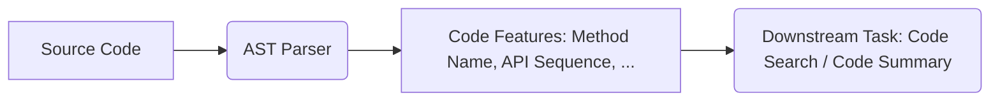
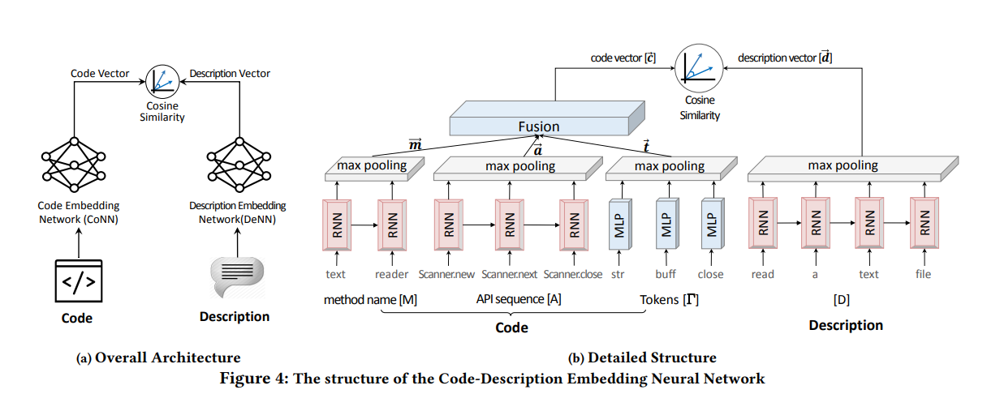

# Programming Assignment 4 - Code Search

> TA Contact: Borui Yang, Hangyu Ye  
> E-mail: ybirua@sjtu.edu.cn, hangyu_ye@outlook.com

> Reference: X. Gu, H. Zhang, and S. Kim, "Deep code search," in 2018 IEEE/ACM 40th International Conference on Software Engineering (ICSE). IEEE, 2018, pp. 933–944.

## 1. Introduction

In this assignment, we implement CodeNN [1], a deep-learning-based system for code search.

In a **code search** task, given a natural language query, the goal is to retrieve the most relevant source code from a code database. To achieve this, we embed both the natural language query and the code in the database into a unified vector space, and find the closest code snippets by measuring their similarities with the query.



### 1.1. Dataset

You are given a dataset with 100,000 samples for training and 10,000 samples for evaluation. The code in this dataset is written in Java. Each sample is of the format

```json
{
    "desc": "natural language description of the code snippet",
    "method_name": "name of the method (function), split by camel case",
    "tokens": "code tokens in the function",
    "apiseq": "api call sequence in the function"
}
```

You can check the format of the datasets by running

```sh
python data_loading.py
```

The dataset files (under `data/`) include

1. `train.json`. The training set.
2. `valid.json`. The validation/testing set.
3. `vocab.comment.json`, `vocab.method_name.json`, `vocab.tokens.json`, `vocab.apiseq.json`. Four vocabulary files.

**You do not need to worry about loading the data.** The provided code already contains all necessary functions for loading and processing the data.

### 1.2. Environment

#### 1.2.1. Python Packages

- **PyTorch** is required for this assignment. The TAs will use PyTorch 2.2 to reproduce your results. The provided code has also been tested on PyTorch 1.12, so it should be also fine if you are using newer versions of PyTorch 1.x.
- **GPU and CUDA** are *required* for this assignment. Running the model on CPU would be prohibitively slow.
  - We have prepared HPC accounts should you need GPU resources. Please see [this canvas announcement](https://oc.sjtu.edu.cn/courses/63653/discussion_topics/148745).
- Refer to `requirements.txt` for other required Python packages for this assignment.

#### 1.2.2. Setting Up the `tree-sitter` Parser

This assignment involves extracting source code features from abstract syntax trees (ASTs). We use a popular parser, [tree-sitter](https://tree-sitter.github.io), to convert Java code snippets into ASTs. Follow the steps below to set up your parser.

**Note.** Building the parser on Windows systems requires the MSVC complier toolchain. You might be prompted by tree-sitter that you need to first install MSVC. In this case please follow the instructions provided by tree-sitter.

```sh
pip install tree-sitter
cd parser

# clone the parser repository for Java
git clone https://github.com/tree-sitter/tree-sitter-java

# build the parser
python build.py

# verify your parser
cd ..
python tree_sitter_hello_world.py
```

If your parser is set up correctly, after running `python tree_sitter_hello_world.py`, you should see an AST and "You are all set!" in your terminal.

#### 1.2.3. Visualizing an AST

`tree-sitter` provides a [playground](https://tree-sitter.github.io/tree-sitter/playground) for visualizing ASTs. For example, the code

```java
public class MyClass {
    public static void MyMethod() {
        System.out.println("Hello world!");
    }
}
```

has an AST listed below

```plaintext
program [0, 0] - [5, 0]
└── class_declaration [0, 0] - [4, 1]
    ├── modifiers [0, 0] - [0, 6]
    ├── name: identifier [0, 13] - [0, 20]
    └── body: class_body [0, 21] - [4, 1]
        └── method_declaration [1, 4] - [3, 5]
            ├── modifiers [1, 4] - [1, 17]
            ├── type: void_type [1, 18] - [1, 22]
            ├── name: identifier [1, 23] - [1, 31]
            ├── parameters: formal_parameters [1, 31] - [1, 33]
            └── body: block [1, 34] - [3, 5]
                └── expression_statement [2, 8] - [2, 43]
                    └── method_invocation [2, 8] - [2, 42]
                        ├── object: field_access [2, 8] - [2, 18]
                        │   ├── object: identifier [2, 8] - [2, 14]
                        │   └── field: identifier [2, 15] - [2, 18]
                        ├── name: identifier [2, 19] - [2, 26]
                        └── arguments: argument_list [2, 26] - [2, 42]
                            └── string_literal [2, 27] - [2, 41]
                                └── string_fragment [2, 28] - [2, 40]
```

- Take the first row `program [0, 0] - [5, 0]` for example. It means the *root node* of this tree is a node of type `program`, and `[0, 0] - [5, 0]` means the code corresponding to the root node spans over lines 0-5.
- On the playground website, you can highlight the code segment corresponding to each node to get a better understanding of the AST.
- You can also use the `pprint_tree` function in `utils.py` to pretty-print an AST in your terminal.

#### 1.2.4. `unittest`

[unittest](https://docs.python.org/3/library/unittest.html) will be used in this assignment to verify the correctness of your code.

You can run a single test by

```sh
# python -m unittest test_extractors.[TestName]
python -m unittest test_extractors.TestClassDeclarationVisitor
```

You can run all tests by

```sh
python test_extractors.py
```

### 1.3. Files

- Task 1 Related
  - `extractors/` (Todo of Task 1) contains the code feature extractors.
  - `test_extractors.py` contains the unit tests to verify your implementation of Task 1.
  - `tree_sitter_hello_world.py` is used for verifying your installation of `tree-sitter`.
- Task 2 Related
  - `loss.py` (Todo of Task 2) contains the cosine similarity loss used for training CodeNN.
  - `model.py` (Todo of Task 2) contains the implementation of CodeNN.
  - `configs.py` (Todo of Task 2) contains a configuration class for hyperparameters.
  - `metrics.py` contains 3 metrics for evaluating the performance of the code search model.
  - `data_loading.py` contains utility functions for loading data.
  - `utils.py` contains a few utility functions for training the model.

## 2. Tasks

The overall workflow of CodeNN is



In this assignment, you need to complete the following two tasks

1. [Extracting code features from ast](#21-extracting-code-features-from-ast)
2. [Implementing CodeNN for code search](#22-implementing-codenn)

**Note.** **We have provided the extracted code features for task 2**. Therefore, there is no dependency in between the two tasks, and it does not matter which one you start with.

### 2.1. Extracting Code Features from AST (40%)

The first step is to extract source code features from the AST. In this assignment, we implement 4 different code feature extractors.

#### 2.1.0. Getting Started with tree-sitter

> Related File: `tree-sitter-ast-intro.ipynb`

(Optional) If you are not familiar with tree-sitter or AST in general, we strongly suggest that you should check `tree-sitter-ast-intro.ipynb` for a detailed tutorial on handling ASTs.

#### 2.1.1. Class Declarations

> Related File: `extractors/class_declaration_visitor.py`

The `ClassDeclarationVisitor` extracts all **class declarations** from the given function.

```java
public class MyClass {
    public static void MyMethod() {
        System.out.println("Hello world!");
    }
}

// Expected output: `["MyClass"]`
```

- **We have provided the implementation of `ClassDeclarationVisitor`**. No further action is required.
- You could use our provided implementation as a reference when implementing your code feature extractors.

#### 2.1.2. Method Declarations

> Related File: `extractors/method_declaration_visitor.py`

The `MethodDeclarationVisitor` extracts all **method names** from a given class.

```java
public class MyClass {
    public void readText(String file) { 
        System.out.println('Hello World.'); 
    }
    public static void printName() {
        System.out.println("MyClass");
    }
}

// Expected output: `['readText', 'printName']`
```

- **Complete the `MethodDeclarationVisitor._dfs()` method.** This method should traverse the AST recursively and collect all method names in the class.

#### 2.1.3. Object Creations

> Related File: `extractors/object_creation_visitor.py`

The `ObjectCreationVisitor` extracts all **constructor invocations** from a method.

```java
public class MyClass {
    public void readText(String file) { 
        BufferedReader br = new BufferedReader(new FileInputStream(file));
    }
}

// Expected output: `['BufferedReader', 'FileInputStream']`
```

- **Complete the `ObjectCreationVisitor._dfs()` method.** This method should traverse the AST recursively and collect all constructor invocations in the method.

#### 2.1.4. Method Invocations

> Related File: `extractors/method_invocation_visitor.py`

The `MethodInvocationVisitor` extracts all **method calls** from a given method.

```java
public class MyClass {
    public void readText(String file) { 
        BufferedReader br = new BufferedReader(new FileInputStream(file)); 
        String line = null; 
        while ((line = br.readLine())!= null) { 
            System.out.println(line); 
        } 
        br.close(); 
    }
}

// Expected output: `['BufferedReader.readLine', 'System.out.println', 'BufferedReader.close']`
```

- **Complete the `MethodDeclarationVisitor._dfs_method_invocation()` method.** This method should traverse the AST recursively and extract an API call sequence from the given method.

#### 2.1.5. Additional Resources for Task 1

- **Check the provided notebook** `tree-sitter-ast-intro.ipynb` for an introduction to processing ASTs.
- **Check the provided implementation** in `ClassDeclarationVisitor` for an example.
- A complete definition for tree-sitter Java AST is available in the `grammar.js` file in the [tree-sitter-java GitHub repository](https://github.com/tree-sitter/tree-sitter-java/blob/master/grammar.js).

### 2.2. Implementing CodeNN (60%)

We then implement the CodeNN model and its training process.

#### 2.2.1. Building the Model

> Related File: `model.py`



The overall architecture of CodeNN is shown in the figure above. Your goal is to implement this model.

- **Complete the constructor `__init__()` of the `CodeNN` module in `model.py`**. Follow the architecture of CodeNN and implement the feature extraction modules.
  - We have already provided a bi-directional LSTM encoder (`BiLSTMEncoder`) and an MLP encoder (`EmbeddingEncoder`) as building blocks. Both modules could be found in `model.py`.
- **Complete the methods `code_features()` and `desc_features()` of the `CodeNN` module in `model.py`**. Follow the figure above and complete the two methods.
  - `code_features()` should extract the code feature vector $\bm{c}$ from the input method name, API sequence and tokens.
  - `desc_features()` should extract the description feature vector $\bm{d}$ from the input natural language description.

#### 2.2.2. Implementing the Loss Function

> Related File: `loss.py`

**Implement the `SimilarityLoss` module in `loss.py`**. During training, each training instance is of the form $\langle  C, D^+, D^- \rangle$: for each code snippet $C$ there is a corresponding positive description $D^+$ and a randomly sampled negative description $D^-$ (i.e., an "incorrect" description for the code $C$). CodeNN uses the following loss function to train the model (see Equation (12) in the paper)

$$ \mathcal{L} = \sum_{\langle C, D^+, D^- \rangle \in P} \max(0, \epsilon - \cos(\bm{c}, \bm{d}^+) + \cos(\bm{c}, \bm{d}^-)), $$

where $\epsilon$ is a constant margin, $P$ denotes the training dataset, $\bm{c}$ denotes the feature vector of $C$, $\bm{d}^+, \bm{d}^-$ respectively denotes the feature vectors of $D^+$ and $D^-$. Intuitively, this loss function maximizes the cosine similarity between the code and its corresponding description, and minimizes the similarity between the code and a random negative sample.

#### 2.2.3. Hyperparameter Tuning

> Related Files: `main.py`, `model.py`, `loss.py`, `config.py`.

Once you have completed the model and the loss function, you could run the training process by

```sh
python main.py
```

Under default settings, it takes around 2GB memory and around 20 minutes to complete the training process (on a GeForce RTX 3080 Laptop GPU). 

The expected Acc@10 on the validation set should be around 0.49. This is because we have only used 100,000 samples for training (less than 1% of the original training set used in CodeNN) in order to cut the total training time. Therefore it is unlikely that our model will reach the reported performance in the paper.

Nonetheless, by modifying the architecture of the model and tuning the hyperparameters, we can still improve the performance of this model.

**Try to improve the performance of your model by modifying model architectures or tuning hyperparameters**. Below we list a few potential improvements for your consideration.

1. **Try increasing the embedding and hidden dimension**. Consider increasing the feature dimensions.
2. **Try modifying the network architecture**. Our provided code follows the open-source implementation of CodeNN, but you can freely adjust the network architecture or the pooling functions (as long as it still uses our provided dataset and code features).
3. **Try tuning the hyperparameters.** Try changing the learning rate, using another optimizer, adding a learning rate scheduler. Also, try changing the margin $\epsilon$ in `SimilarityLoss`.

**WARNING.** The total number of parameters of your model should be **no more than 50M**. A deduction will follow if your model exceeds this limit.

## 3. Submission & Requirements

### 3.1. Submission

You need to submit

1. All python source code files, for both Task 1 and Task 2.
2. A `.log` file that records your training and evaluation process (generated automatically under `output/[timestamp]-[expname]/logs/`).

Submit your results and all source code as a ZIP file, named as `[StudentID]_[ChineseName]_HW4.zip` (e.g., `521030910000_张三_HW4.zip`). The following files are REQUIRED in your submission.

```plaintext
521030910000_张三_HW4/
├── extractors/
│   └── *.py                          # source code for code feature extractors
├── output/
│   └── YYYY-mm-dd-HH-MM/
│       └── logs/
│           └── YYYY-mm-dd-HH-MM.log  # a log file for your best model
└── *.py                              # all other related Python source code
```

1. Please ensure that your submission is self-contained, i.e., it contains all necessary Python files for your project to run.
2. Please ensure that your `configs.py` contains the necessary hyperparameters for us to replicate your results.
3. Please ensure that your `.log` file contains the final evaluation results (see below). This final result will be used for automated grading.
4. Please submit one `.log` file only. If multiple log files are submitted, we will only use the log with *the latest timestamp* for grading.
5. Please DO NOT submit your parser, your model checkpoints, or the datasets.

#### 3.1.1. More on `.log` Submission

Everytime `main.py` is executed, it will generate a `.log` file under `output/[timestamp]-[expname]/logs/`, and the corresponding model checkpoint will be stored under `output/[timestamp]-[expname]/models/`.

If the training process completes without error, `main.py` will load the best model and run a final evaluation. The results for this final evaluation will be written to the log file, e.g.,

```log
// Last two lines of the log
[INFO 2024-05-07 12:26:06,172]: Number of trainable parameters: 5,810,000
[INFO 2024-05-07 12:26:06,172]: Final eval result: {"ACC@10": 0.4918000102043152, "MRR": 0.25432175397872925, "NDCG@10": 0.31037163734436035}
```

- **Please ensure your submitted log contains the two lines above**. These two lines will be used for automated grading.
- If the training process is interrupted, by default `main.py` will still try to load the best model and run the final evaluation. However, if the training process exits due to unexpected error, `main.py` will NOT run the evaluation.

### 3.2. Requirements

1. **Do NOT use additional training data.** Your model should be trained using only our provided 100,000 samples and our provided vocabulary.
2. **Do NOT use pre-trained language models.** While you can freely modify the architecture of the model, you are not allowed to use pre-trained models (e.g., those from HuggingFace) in this assignment.
3. **Do NOT modify functions or code sections marked with `XXX: Do NOT modify ...`.** Contact the TAs in advance if you do have the need to modify these functions.
4. **Other than the functions stated above, you can make any changes you wish.** You can also add new files or remove unused files as you need. However, please ensure your submission is self-contained.
5. **Do NOT directly copy others' code,** whether from your classmates, previous years' solutions, GitHub or generative AIs. If you refer to other's implementations, you need to explicitly acknowledge the source.
6. **Ensure that your code is runnable and reproducible.** We will run your code and verify the results. A penalty will be imposed on your final score if there is a significant gap between your reported results and our reproduced ones.
7. **You are encouraged (but not required) to follow good programming habits**. E.g., use meaningful variable names, write comments where necessary, avoid extremely long lines, etc. This, however, will not affect your score.

## 4. Grading

### 4.1. Code Feature Extraction (40%)

We will use the test cases in `test_extractors.py` to verify your implementation. Full 40% if your code passes all our test cases, and deducted proportionally if some cases fail.

Please note that **a few unreleased test cases will be used**. This is mainly to counter hard-coded solutions.

### 4.2. CodeNN Implementation (60%)

We will score your implementation based on the ACC@10 metric. You need to tune your hyper-parameters to get the optimal performance and full 100% score.

|                   Metrics                   |      Score       |
| :-----------------------------------------: | :--------------: |
| Code runs without error. ACC@10 above 0.60. |       60Pt       |
| Code runs without error. ACC@10 above 0.50. |   55Pt - 60Pt    |
| Code runs without error. ACC@10 above 0.45. |   50Pt - 55Pt    |
| Code runs without error. ACC@10 above 0.20. |   20Pt - 50Pt    |
|                Other cases.                 | Manually scored. |

## 5. Discussion: Pre-Trained Models for Code

It might seem that an LSTM-based model from a work published in 2018 is somewhat "outdated" in the era of large language models. This is true (partially).

In recent years, following the success of transformer-based models in natural language processing, a variety of pre-trained models and large language models (LLMs) specifically designed for source code have emerged. Notable examples include CodeGPT [2], CodeBERT [3], CodeGen [4] and CodeX [5], etc. Additionally, trained on extensive web-scale corpora, modern LLMs (such as ChatGPT) are also capable of handling source code.

Unfortunately, for practical reasons (such as extensive GPU memory and training time requirements), we have not included these large models into this programming assignment.

Additionally, even after the rise of pre-trained models, the syntactic and semantic features of code (ASTs, control flows, data flows, etc.) still maintain their importance and utility in various code-related tasks.

If you are interested in the topic of source code processing, we encourage you to delve deeper and consider related topics for your final project.

## References

1. X. Gu, H. Zhang, and S. Kim, "Deep code search," in 2018 IEEE/ACM 40th International Conference on Software Engineering (ICSE). IEEE, 2018, pp. 933–944.
2. S. Lu et al., "Codexglue: A machine learning benchmark dataset for code understanding and generation", arXiv preprint arXiv:2102. 04664, 2021.
3. Z. Feng et al., "Codebert: A pre-trained model for programming and natural languages", arXiv preprint arXiv:2002. 08155, 2020.
4. E. Nijkamp et al., "Codegen: An open large language model for code with multi-turn program synthesis", arXiv preprint arXiv:2203. 13474, 2022.
5. M. Chen et al., "Evaluating large language models trained on code", arXiv preprint arXiv:2107. 03374, 2021.
