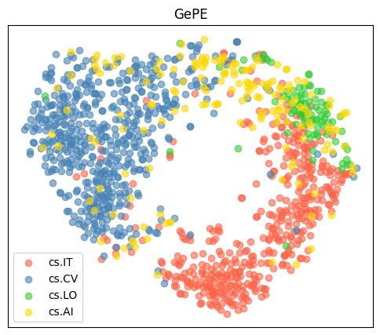
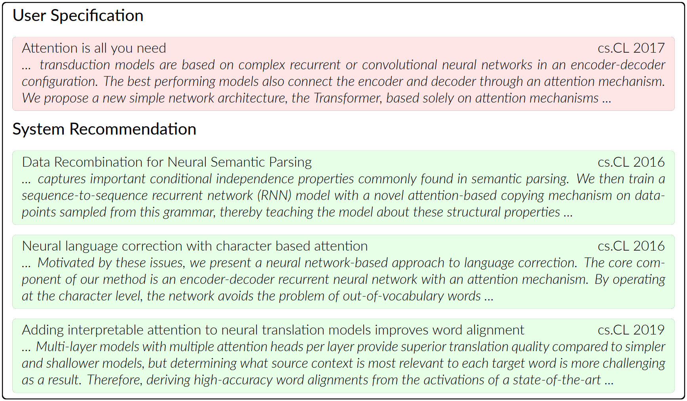

<h1 align="center">
GePE: Generalizable Paper Embedding with Language-Driven Biased Random Walk
</h1>
<p align="center">
    Project of AI3602 Data Mining, 2024 Spring, SJTU
    <br />
    <a href="https://github.com/Loping151"><strong>Kailing Wang</strong></a>
    &nbsp;
    <a href="https://github.com/Shi-Soul"><strong>Weiji Xie</strong></a>
    &nbsp;
    <a href="https://github.com/xxyQwQ"><strong>Xiangyuan Xue</strong></a>
    &nbsp;
</p>
<p align="center">
    <a href="https://github.com/Loping151/GePE">  </a>
    <!-- <a href="assets/slides.pdf">  </a> -->
    <a href='assets/poster.pdf'>  </a>
</p>

This project introduces the Generalizable Paper Embedding (GePE) model, which leverages both textual and structural information from academic papers to improve paper classification, citation prediction, and recommendation tasks. Using a language-driven biased random walk, GePE efficiently captures semantic relationships between papers, enhancing the embeddings' quality and applicability to unseen data. This approach helps researchers effectively navigate and analyze extensive academic literature.

## 🛠️ Requirements

You can install them following the instructions below.

* Create a new conda environment and activate it:
  
    ```bash
    conda create -n gepe python=3.10
    conda activate gepe
    ```

* Install [pytorch](https://pytorch.org/get-started/previous-versions/) with appropriate CUDA version and corresponding `pyg-lib`, e.g.
  
    ```bash
    pip install torch==1.12.1+cu113 torchvision==0.13.1+cu113 torchaudio==0.12.1 --extra-index-url https://download.pytorch.org/whl/cu113
    pip install pyg-lib -f https://data.pyg.org/whl/torch-1.12.1+cu113.html
    ```

* Then install other dependencies:
  
    ```bash
    pip install -r requirements.txt
    ```

Latest version is recommended for all the packages, but make sure that your CUDA version is compatible with your `pytorch`.

## ⚓ Preparation

Before training, you should prepare the necessary dataset and embedding. In this project, we use [ogbn-arxiv](https://ogb.stanford.edu/docs/nodeprop/#ogbn-arxiv) dataset for experiments. Although the graph can be downloaded automatically, you have to download the raw texts of titles and abstracts manually by running the following commands:

```bash
PYTHONPATH=. python dataset/dataloader.py # This would download ogbn-arxiv
mkdir data && cd data
wget https://snap.stanford.edu/ogb/data/misc/ogbn_arxiv/titleabs.tsv.gz
gunzip titleabs.tsv.gz
```

To test the encoding ability of Scibert without node2vec, you can run the following command to download model and generate the embeddings: 

```bash
PYTHONPATH=. python dataset/embedding.py
```

If you want to train bert-based models, we recommend pretokenize the abstract of papers in the dataset and cache them as files. For each model, run the following command to generate the embeddings:

```bash
PYTHONPATH=. python model/the_model_you_want_to_use.py # scibert, distilbert, bert.
```

After running the above commands, the data structure should be like this:

```
- data/
  |- ogbn_arxiv/
  |- titleabs.tsv
  |- embeddings_cls.pth
  |- embeddings_mean.pth
  |- pre_tokenize.pth
  |- other similar stuff
- utils/
- model/
- other_folders/
- *.py
- readme.md
```

## 🚀 Training

Training arguments can be found in `utils/args.py`. You can run the following command to train the model:

```bash
python train.py --model_type embedding --batch_size 16384 
python train.py --model_type pretrained_bert --batch_size 8192 
python train.py --model_type pretrained_bert --batch_size 8192 --pretrain your_model.pth # allow resume training
```

The batch size set above is for GPUs with 24GB memory. You can adjust the batch size according to your GPU memory.

Here is a visualization of the embedding space of our method:



## 💯 Evaluation

We support two types of evaluation: classification and link prediction. You can run the following commands to evaluate the model:

```bash
python validate_cls.py --model_type pretrained_bert --pretrain your_model.pth
python validate_lp.py --model_type pretrained_bert --pretrain your_model.pth
```

Here are our evaluation results for your reference:

| Method           | \# Parameters   | Generalizable | NC (ACC) | LP (AUC) |
|------------------|:---------------:|:-------------:|:--------:|:--------:|
| Hash Mapping     | $3.7\text{M}$   | No            | $9.8\%$  | $0.558$  |
| Vanilla Embedding| $130.0\text{M}$ | No            | $60.5\%$ | $0.934$  |
| Language Encoding| $30.5\text{M}$  | Yes           | $26.9\%$ | $0.733$  |
| GePE (ours)      | $23.1\text{M}$  | Yes           | $68.3\%$ | $0.859$  |

Refer to the poster if you want to see more details.

## 🤖 Demo

We provide a recommendation system based on the trained model. You can run the following command to start the recommendation application:

```bash
# To run in command line
PYTHONPATH=. python app/rs_cmd.py --model_type scibert # Note that the default pretrained path is model/test.pth
# To run in gradio
PYTHONPATH=. python app/rs_gradio.py --model_type scibert
```

Here is a sample result of the recommendation system:

