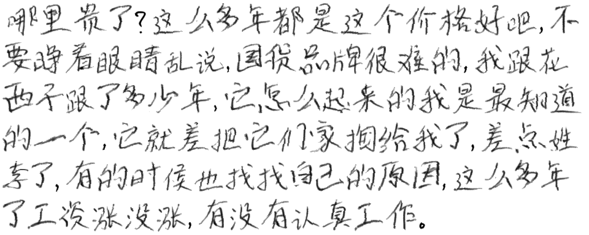

<h1 align="center">
MetaScript: Few-Shot Handwritten Chinese Content Generation via Generative Adversarial Networks
</h1>
<p align="center">
    Project of AI3604 Computer Vision, 2023 Fall, SJTU
    <br />
    <a href="https://github.com/Bujiazi"><strong>Jiazi Bu</strong></a>
    &nbsp;
    <a href="https://github.com/IApple233"><strong>Qirui Li</strong></a>
    &nbsp;
    <a href="https://github.com/Loping151"><strong>Kailing Wang</strong></a>
    &nbsp;
    <a href="https://github.com/xxyQwQ"><strong>Xiangyuan Xue</strong></a>
    &nbsp;
    <a href="https://github.com/wdask"><strong>Zhiyuan Zhang</strong></a>
    <br />
</p>
<p align="center">
    <a href='assets/sample/report.pdf'>  </a>
    <a href="assets/sample/slides.pdf">  </a>
    <a href="http://cv2023.loping151.com/?__theme=light">  </a>
</p>

This project aims to generate handwritten Chinese content within several style references based on generative adversarial networks. Our model can generate 128x128 resolution images of handwritten Chinese characters. Then the complete content is synthesized with traditional computer vision techniques. Some results are shown as follows.


> 哪里贵了？这么多年都是这个价格好吧，不要睁着眼睛乱说，国货品牌很难的，我跟花西子跟了多少年，它怎么起来的我是最知道的一个，它就差把它们家掏给我了，差点姓李了，有的时候也找找自己的原因，这么多年了工资涨没涨，有没有认真工作。



## 🛠️ Requirements

To ensure the code runs correctly, the following packages are required:

* `python`
* `hydra`
* `pytorch`

You can install them following the instructions below.

* Create a new conda environment and activate it:
  
    ```bash
    conda create -n metascript python=3.10
    conda activate metascript
    ```

* Install [pytorch](https://pytorch.org/get-started/previous-versions/) with appropriate CUDA version, e.g.
  
    ```bash
    pip install torch==1.12.1+cu113 torchvision==0.13.1+cu113 torchaudio==0.12.1 --extra-index-url https://download.pytorch.org/whl/cu113
    ```

* Install `hydra`:
  
    ```bash
    pip install hydra-core
    ```

The latest version is recommended for all the packages, but make sure that your CUDA version is compatible with your `pytorch`.

## 🚀 Training

The dataset used for training is mainly adapted from [CASIA-HWDB-1.1](http://www.nlpr.ia.ac.cn/databases/handwriting/Offline_database.html). We put the characters by the same writer into the same directory. The folder name represents the writer and the file name represents the character. We render the template characters from [Source-Han-Sans](https://github.com/adobe-fonts/source-han-sans). You can download the dataset [here](https://pan.baidu.com/s/11T8jgBQUh8f0-H5FbuO84w?pwd=1024) and extract it.

You can also build the dataset by yourself for customization. The directory structure is as follows:

```
dataset
├── script
│   ├── writer_1
│   │   ├── character_1.png
│   │   ├── character_2.png
│   │   └── ...
│   ├── writer_2
│   │   ├── character_1.png
│   │   ├── character_2.png
│   │   └── ...
│   └── ...
└── template
    ├── character_1.png
    ├── character_2.png
    └── ...
```

Then modify the configuration file in the `config` directory, where `dataset_path` must be correctly set as the path to your dataset. You can also modify the hyperparameters or create a new configuration file as you like, but remember to modify the `hydra` arguments in `training.py` accordingly. Here we provide a template configuration file `config/training.yaml`. The batch size is set to 16 by default, which requires at least 6GB GPU memory.

Run the following command to train the model:

```bash
python training.py
```

## 💡 Inference

The template configuration file `config/inference.yaml` contains the necessary arguments for inference. You should correctly set `model_path` as the path to your generator model. Then `reference_path` should be the path to your reference directory, which contains images for style reference. We provide `assets/reference` as an example.

We provide a pre-trained model [here](https://pan.baidu.com/s/1UGHPKFVSvRj2QY_PbSjJGQ?pwd=1024), whose `reference_count` is 4. Notice that `reference_count` means the number of reference images used by the model, which should be consistent with your model setting. If you provide more reference images than this number, only a subset of them will be actually used. Do not modify it unless you know what you are doing.

Fill your input text in `target_text` and run the following command to generate the result:

```bash
python inference.py
```

## 🤖 GUI Demo and API

We've built a GUI module inside this project. To run GUI, you need to install gradio in your venv:

```bash
pip install gradio # recommend 4.9.0 or later
```

Then run
```bash
python -m gui [--port PORT]
```
to launch GUI locally. The default port is 8111.
