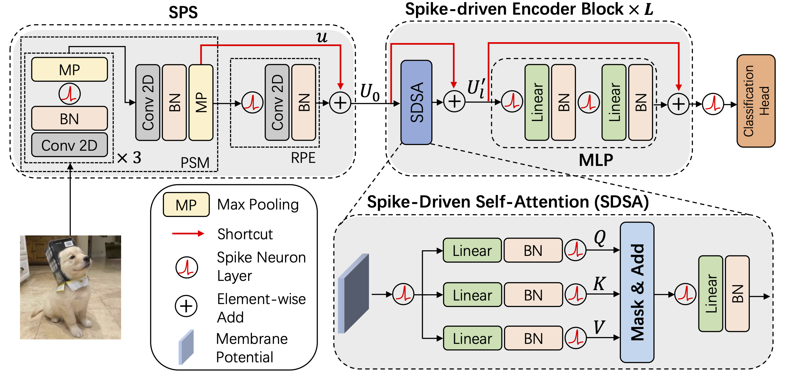

<h1 align="center">
Reproduction of Paper: Spike-driven Transformer
</h1>
<p align="center">
    Project of AI3610 Brain-inspired Intelligence, 2023 Fall, SJTU
    <br />
    <a href="https://github.com/xxyQwQ"><strong>Xiangyuan Xue</strong></a>
    &nbsp;
    <a href="https://github.com/YsmmsY"><strong>Shengmin Yang</strong></a>
    &nbsp;
    <a href="https://github.com/Ark-ike"><strong>Yi Ai</strong></a>
    <br />
</p>
<p align="center">
    <a href="https://github.com/Ark-ike/spike-driven-transformer">  </a>
    <a href="assets/slides.pdf">  </a>
    <a href='assets/report.pdf'>  </a>
</p>

This project reproduces the paper [Spike-driven Transformer](https://arxiv.org/abs/2307.01694). We simplify the implementation and introduce transfer learning. For training, CIFAR-10, CIFAR-100, CIFAR-10-DVS, DVS-128-Gesture and ImageNet-1k-128 are supported. For finetuning, CIFAR-10 and CIFAR-100 are supported.



## 🛠️ Requirements

To ensure the code runs correctly, following packages are required:

* `python`
* `pytorch`
* `hydra`
* `einops`
* `spikingjelly`

You can install them following the instructions below.

* Create a new conda environment and activate it:
  
    ```bash
    conda create -n spikingjelly python=3.10
    conda activate spikingjelly
    ```

* Install [pytorch](https://pytorch.org/get-started/previous-versions/) with appropriate CUDA version, e.g.
  
    ```bash
    pip install torch==1.12.1+cu113 torchvision==0.13.1+cu113 torchaudio==0.12.1 --extra-index-url https://download.pytorch.org/whl/cu113
    ```

* Install `hydra`, `einops` and `spikingjelly`:
  
    ```bash
    pip install hydra-core
    pip install einops
    pip install spikingjelly
    ```

Latest version is recommended for all the packages, but make sure that your CUDA version is compatible with your `pytorch`.

## 🚀 Experiments

### CIFAR-10

The CIFAR-10 dataset is supported by `torchvision`, which can be automatically downloaded. Run the following command for experiments on the CIFAR-10 dataset:

```bash
python training.py experiment=cifar-10
```

### CIFAR-100

The CIFAR-100 dataset is also supported by `torchvision`. Run the following command for experiments on the CIFAR-100 dataset:

```bash
python training.py experiment=cifar-100
```

### CIFAR-10-DVS

The CIFAR-10-DVS dataset is loaded by `spikingjelly` and can be automatically downloaded. Run the following command for experiments on the CIFAR-10-DVS dataset:

```bash
python training.py dataset=cifar-10-dvs
```

Since neuromorphic datasets require larger time steps, a smaller batch size is recommended.

### DVS-128-Gesture

The DVS-128-Gesture dataset is also loaded by `spikingjelly`, but you need to download the dataset manually. Run the following command for experiments on the DVS-128-Gesture dataset:

```bash
python training.py dataset=dvs-128-gesture
```

It is likely that `spikingjelly` will raise an error at the first time you run the experiment. Follow the instructions to download the dataset correctly and try again. Similarly, a smaller batch size is recommended.

### ImageNet-1k-128

The ImageNet-1k dataset is loaded by `torchvision`, but you should prepare the dataset manually. Run the following command to download and extract the dataset:

```bash
cd dataset && . ./imagenet-1k.sh
```

Since resizing images is extremely time-consuming, we provide a script to process the dataset in advance. Run the following command to process the dataset:

```bash
cd dataset && python imagenet-1k-128.py
```

Then run the following command for experiments on the ImageNet-1k dataset:

```
python training.py experiment=imagenet-1k-128
```

### CIFAR-10-Finetune

Before finetuning, you should first pretrain the model on the ImageNet-1k dataset. Then set the `model` argument to the path of the pretrained model in the configuration file. Run the following command for finetuning on the CIFAR-10 dataset:

```bash
python finetune.py experiment=cifar-10-finetune
```

### CIFAR-100-Finetune

Similarly, you should set the `model` argument correctly in the configuration file. Run the following command for finetuning on the CIFAR-100 dataset:

```bash
python finetune.py experiment=cifar-100-finetune
```
