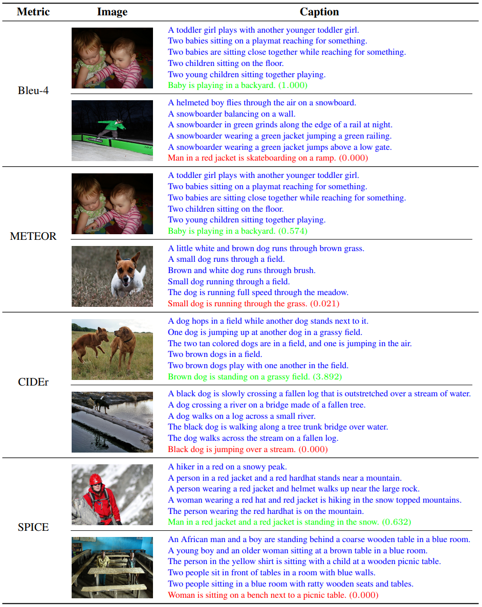

<h1 align="center">
Image Caption Generation with Visual Attention
</h1>
<p align="center">
    Project of AI3611 Intelligent Perception and Cognition Practice, 2024 Spring, SJTU
</p>

This project aims to explore solving the image caption generation task by using the encoder-decoder framework with visual attention. We introduce the image captioner model, the scheduled sampling and beam search methods, and the various evaluation metrics. We conduct experiments to investigate how the hyperparameters affect the performance of the model. We also conduct ablation studies to verify the effectiveness of the scheduled sampling and beam search methods.

## 🛠️ Requirements

You can install them following the instructions below.

* Create a new conda environment and activate it:
  
    ```bash
    conda create -n pytorch python=3.10
    conda activate pytorch
    ```

* Install [pytorch](https://pytorch.org/get-started/previous-versions/) with appropriate CUDA version, e.g.
  
    ```bash
    pip install torch==1.12.1+cu113 torchvision==0.13.1+cu113 torchaudio==0.12.1 --extra-index-url https://download.pytorch.org/whl/cu113
    ```

* Then install other dependencies:
  
    ```bash
    pip install nltk pycocoevalcap
    pip install tqdm fire loguru Pillow PyYAML
    pip install numpy pandas matplotlib scikit-image
    ```

* Download resources for `nltk` in Python:
  
    ```python
    >>> import nltk
    >>> nltk.download('punkt')
    ```

Latest version is recommended for all the packages, but make sure that your CUDA version is compatible with your `pytorch`.

## 🚀 Experiments

First you need to download the [Flickr8k](https://www.kaggle.com/datasets/adityajn105/flickr8k) dataset and extract it to the `dataset` folder. Then you can train the model with default parameters by running the following command:

```bash
python train.py mainloop config/default/baseline.yaml
```

You can also specify the configuration file by modifying the path in the command line. See the `config` folder for reference.

We write all the experiment commands in the `script` folder. The best model uses $256$ embedding size and $256$ hidden size with scheduled sampling and beam search enabled. The model achieves the best performance in terms of multiple evaluation metrics as follows:

| Bleu-4 | Rouge-L | METEOR | CIDEr | SPICE | SPIDEr |
|--------|---------|--------|-------|-------|--------|
| 0.202  | 0.420   | 0.190  | 0.527 | 0.146 | 0.337  |

You can reproduce it by running the following command:

```bash
bash script/best.sh
```

You can reproduce the results of model performance by running the following command:

```bash
bash script/architecture.sh
```

You can reproduce the results of ablation study by running the following commands:

```bash
bash script/schedule.sh
bash script/sample.sh
```

The results and models will be saved in the `checkpoint` folder.

You can evaluate the model by running the following command:

```bash
python evaluate.py --checkpoint /path/to/your/checkpoint
```

## 🎬 Samples

Here are some sample images and captions  with the best and worst scores in Bleu-4, METEOR, CIDEr and SPICE metrics:



Here is a sample prediction given by the model:

```json
[
    {
        "img_id": "2901880865_3fd7b66a45.jpg",
        "prediction": [
            "surfer in a black wetsuit is riding a wave in a wave ."
        ]
    },
    {
        "img_id": "241345844_69e1c22464.jpg",
        "prediction": [
            "football player in a red uniform and white uniform is watching the player in red ."
        ]
    }
]
```

Here is a sample evaluation result:

```text
{'metric': 'Blue-1',
 'score': '0.602',
 'best': {'name': '3191135894_2b4bdabb6d.jpg',
          'value': '1.000',
          'reference': ['A crowd at an outdoor event .',
                        'A crowd is gathering on a grassy plain .',
                        'A smaller art festival on the edge of a forest',
                        'children play in grass at a crowded outdoor festival .',
                        'People mingling at colorful fair .'],
          'prediction': ['group of people are walking in a field .']},
 'worst': {'name': '2938120171_970564e3d8.jpg',
           'value': '0.063',
           'reference': ['A large dog sniffing a smaller dog outside .',
                         'Two blond dogs are standing together on a patio .',
                         'Two dogs are standing together on a patio .',
                         'Two golden dogs are standing on a wooden patio .',
                         'Two golden dogs on a wood deck .'],
           'prediction': ['golden retriever is standing on a wooden floor .']}}
```