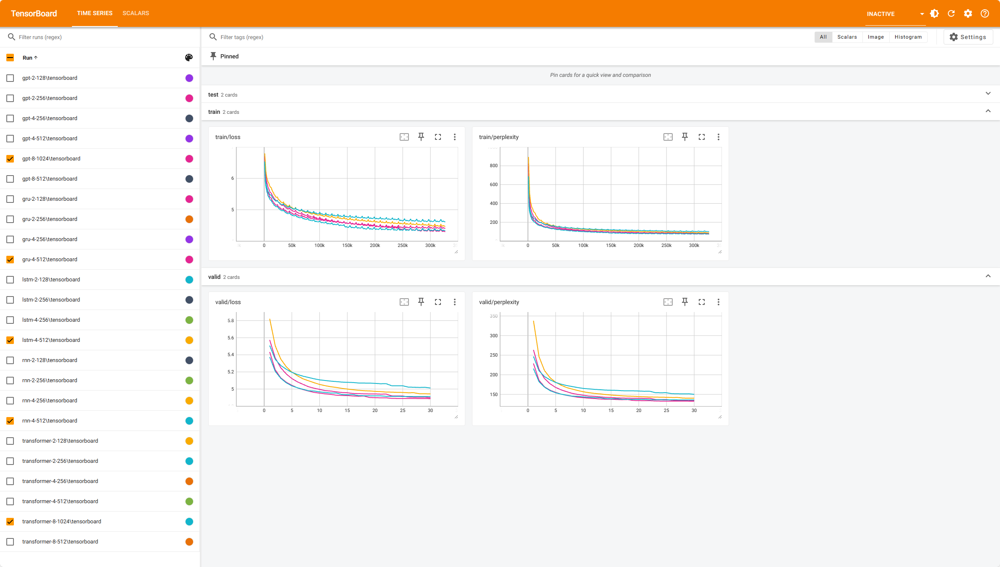

<h1 align="center">
Language Modeling with Deep Neural Networks
</h1>
<p align="center">
    Project of AI3611 Intelligent Perception and Cognition Practice, 2024 Spring, SJTU
</p>

This project aims to research on language modeling with deep neural networks. We explore multiple architectures including RNNs, LSTM, GRU, transformers and GPTs. We introduce the principles of the models and train the models on the given dataset to compare the performance of different architectures. We also conduct ablation studies to investigate the effects of different hyperparameters on the performance. Besides, we give an explanation to the anomaly about the inadequate performance of the Transformer-based models.

## 🛠️ Requirements

You can install them following the instructions below.

* Create a new conda environment and activate it:
  
    ```bash
    conda create -n pytorch python=3.10
    conda activate pytorch
    ```

* Install [pytorch](https://pytorch.org/get-started/previous-versions/) with appropriate CUDA version, e.g.
  
    ```bash
    pip install torch==1.12.1+cu113 torchvision==0.13.1+cu113 torchaudio==0.12.1 --extra-index-url https://download.pytorch.org/whl/cu113
    ```

* Then install other dependencies:
  
    ```bash
    pip install hydra-core numpy tensorboard einops
    ```

Latest version is recommended for all the packages, but make sure that your CUDA version is compatible with your `pytorch`.

## 🚀 Experiments

You can train the language model with default parameters by running the following command:

```bash
python main.py model=RNN
```

where `model` can be `RNN`, `LSTM`, `GRU`, `Transformer`, `GPT`. You can also specify the hyperparameters by adding them to the command line. See `main.yaml` in the `config` folder for reference.

We write all the experiment commands in the `script` folder. The best model employs the GPT architecture with $384$ embedding size, $2048$ hidden size, $16$ attention heads, $8$ decoder layers and $128$ sequence length, whose number of parameters is $59.54\text{M}$ and the perplexity is $130.57$. You can reproduce it by running the following command:

```bash
bash script/best.sh
```

You can reproduce the results of model performance by running the following command:

```bash
bash script/model.sh
```

You can reproduce the results of ablation study by running the following commands:

```bash
bash script/embedding.sh
bash script/dropout.sh
bash script/sequence.sh
```

You can reproduce the results of anomaly explanation by running the following commands:

```bash
bash script/inheritance.sh
```

The results and models will be saved in the `checkpoint` folder.

You can generate samples from the trained models by running the following command:

```bash
python sample.py checkpoint=checkpoint/RNN model=RNN
```

where `checkpoint` should be specified to the path containing the `model.pth` file. You can also monitor the training process with `tensorboard` by running the following command:

```bash
tensorboard --logdir=checkpoint/model
```

where `logdir` should be specified to the checkpoint folder.

## 🎬 Samples

Here is a sample of monitering the training process with `tensorboard`:



Here are some samples generated by the best model:

> to present my wife and i was now drenched with her \<eos> perhaps she told me that she believed me so great that i had stood so much \<eos> and sought to do something which gave me dust to a novelty of fresh water \<eos> from the contamination of which i may not feel the irritation \<eos> it was such an odd feeling that my plans had been so big \<eos> and i was conscious of being fired \<eos>

We explain the abnormal phenomenon that the performance of the Transformer-based models fail to defeat the RNN-based models as follows:

> The anomaly is mainly caused by the unfair training strategy. For the RNN-based models, the hidden states computed from the last batch are feeded together with the current batch, so they can break the limitation of the sequence length and capture information from longer history. In contrast, the Transformer-based models are only feeded with the current batch, which limits the context information they can fetch.

See the project report for more details and supporting evidence.