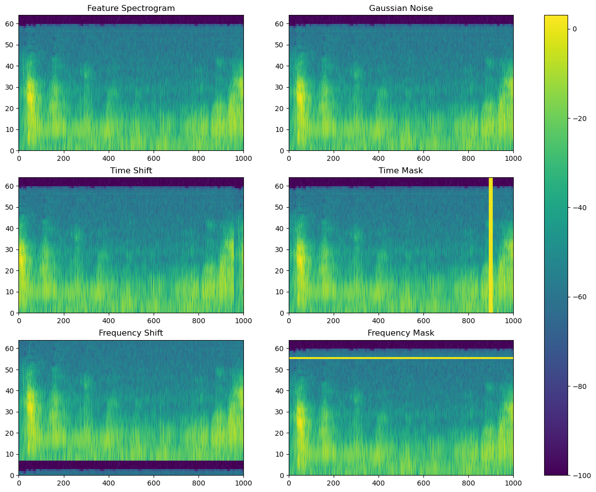

<h1 align="center">
Weakly Supervised Sound Event Detection
</h1>
<p align="center">
    Project of AI3611 Intelligent Perception and Cognition Practice, 2024 Spring, SJTU
</p>

This project aims to explore weakly supervised sound event detection. We reveal the challenges of the unsupervised setting and implement a mainstream framework based on CRNN to solve the problem. We conduct experiments to research how the hyperparameters affect the performance of the model. We also investigate various data augmentation methods and conduct ablation studies to verify the effectiveness of these methods.

## 🛠️ Requirements

You can install them following the instructions below.

* Create a new conda environment and activate it:
  
    ```bash
    conda create -n pytorch python=3.10
    conda activate pytorch
    ```

* Install [pytorch](https://pytorch.org/get-started/previous-versions/) with appropriate CUDA version, e.g.
  
    ```bash
    pip install torch==1.12.1+cu113 torchvision==0.13.1+cu113 torchaudio==0.12.1 --extra-index-url https://download.pytorch.org/whl/cu113
    ```

* Then install other dependencies:
  
    ```bash
    pip install librosa==0.9.1 soundfile sed-eval
    pip install tqdm fire loguru tabulate PyYAML pypeln h5py
    pip install numpy pandas matplotlib scipy scikit-learn scikit-multilearn
    ```

Latest version is recommended for all the packages, but make sure that your CUDA version is compatible with your `pytorch`, and the version of `librosa` is `0.9.1`.

## 🚀 Experiments

First, you need to download the [DCASE2018](https://github.com/DCASE-REPO/dcase2018_baseline/tree/master/task4/dataset) dataset and extract all the files. Then you can run the following command to prepare the dataset:

```bash
bash script/dataset.sh /path/to/your/dataset
```

The extracted feature will be stored in the `dataset` folder. Clean the folder before you run the script again.

You can train the model with default parameters by running the following command:

```bash
python train.py mainloop config/default/baseline.yaml
```

You can also specify the configuration file by modifying the path in the command line. See the `config` folder for reference.

We write all the experiment commands in the `script` folder. The best model contains $5$ convolutional layers, $1$ recurrent layer and $128$ hidden units, with the time shift augmentation enabled. The model achieves an event-based F1 score of $0.188$ on the evaluation set. You can reproduce it by running the following command:

```bash
bash script/best.sh
```

You can reproduce the results of model performance by running the following command:

```bash
bash script/architecture.sh
```

You can reproduce the results of ablation study by running the following command:

```bash
bash script/augmentation.sh
```

The results and models will be saved in the `checkpoint` folder.

You can evaluate the model by running the following command:

```bash
python evaluate.py --prediction /path/to/your/prediction --label /path/to/your/label --target /path/to/your/target
```

## 🎬 Samples

Here is an illustration of the data augmentation methods investigated in this project:



Here is a sample prediction given by the model:

```text
filename	event_label	onset	offset
YsT0c3VFcq7g_30.000_40.000.wav	Speech	0.000	0.380
YsT0c3VFcq7g_30.000_40.000.wav	Speech	3.440	4.100
YsT0c3VFcq7g_30.000_40.000.wav	Speech	5.920	6.680
YsT0c3VFcq7g_30.000_40.000.wav	Cat	2.060	3.440
YsT0c3VFcq7g_30.000_40.000.wav	Cat	4.360	5.460
YsT0c3VFcq7g_30.000_40.000.wav	Cat	7.860	10.020
```

Here is a sample report of the model evaluation:

```text
|               |   f_measure |   precision |   recall |
|---------------|-------------|-------------|----------|
| event_based   |    0.188233 |    0.172165 | 0.239325 |
| segment_based |    0.606    |    0.614423 | 0.609929 |
| tagging_based |    0.643831 |    0.654887 | 0.642221 |
mAP: 0.6859426842421412
```