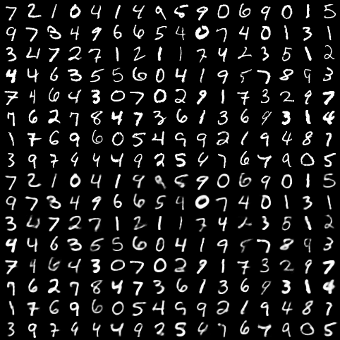
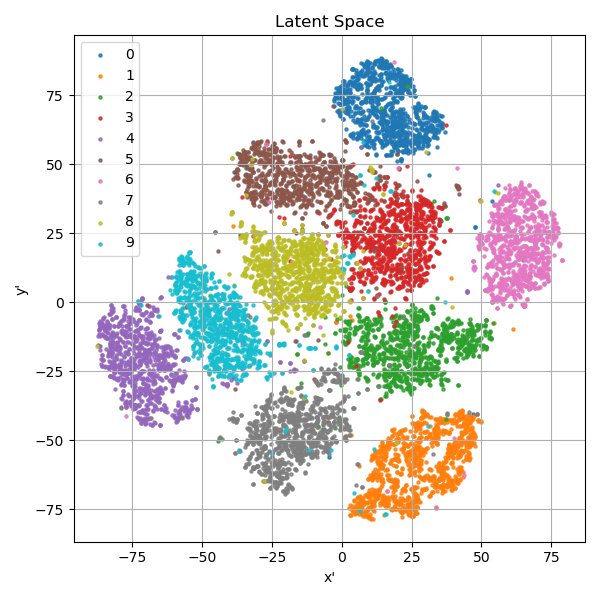

<h1 align="center">
Variational Autoencoder for Image Generation
</h1>
<p align="center">
    Project of AI3611 Intelligent Perception and Cognition Practice, 2024 Spring, SJTU
</p>

This project aims to research on applying VAE for image generation. We derive the mathematical formulation of VAE and implement a simple VAE model for generating handwritten digits on the MNIST dataset. We investigate the influence of the latent space on the generation process and possible ways to minimize the reconstruction error to improve the quality of the generated images. 

## 🛠️ Requirements

You can install them following the instructions below.

* Create a new conda environment and activate it:
  
    ```bash
    conda create -n pytorch python=3.10
    conda activate pytorch
    ```

* Install [pytorch](https://pytorch.org/get-started/previous-versions/) with appropriate CUDA version, e.g.
  
    ```bash
    pip install torch==1.12.1+cu113 torchvision==0.13.1+cu113 torchaudio==0.12.1 --extra-index-url https://download.pytorch.org/whl/cu113
    ```

* Then install other dependencies:
  
    ```bash
    pip install tqdm hydra-core numpy matplotlib scikit-learn
    ```

Latest version is recommended for all the packages, but make sure that your CUDA version is compatible with your `pytorch`.

## 🚀 Experiments

You can train the VAE model with default parameters by running the following command:

```bash
python main.py
```

You can visualize the latent space by running the following command:

```bash
python plot.py
```

We write all the experiment commands in `run.sh`. You can reproduce the results by simply executing the following command:

```bash
bash run.sh
```

The results and models will be saved in the `checkpoint` folder.

## 🎬 Samples

Here are some generated samples from the trained VAE model:



Here is a visualization of the latent space:

