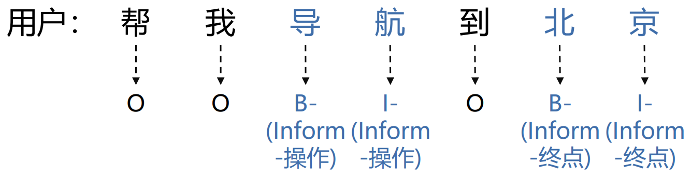

<h1 align="center">
Exploring Slot Filling Method for Task Oriented Spoken Language Understanding
</h1>
<p align="center">
    Project of CS3602 Natural Language Processing, 2023 Fall, SJTU
    <br />
    <a href="https://github.com/xxyQwQ"><strong>Xiangyuan Xue</strong></a>
    &nbsp;
    <a href="https://github.com/wcr369"><strong>Chenrun Wang</strong></a>
    &nbsp;
    <a href="https://github.com/Ken-Bing"><strong>Zeyi Zheng</strong></a>
    <br />
</p>
<p align="center">
    <a href='assets/report.pdf'>  </a>
    <a href="https://github.com/wcr369/Spoken-Language-Understanding">  </a>
</p>

This project aims to explore different slot filling methods for task oriented spoken language understanding (SLU).



## 🛠️ Requirements

You can install them following the instructions below.

* Create a new conda environment and activate it:
  
    ```bash
    conda create -n pytorch python=3.10
    conda activate pytorch
    ```

* Install [pytorch](https://pytorch.org/get-started/previous-versions/) with appropriate CUDA version, e.g.
  
    ```bash
    pip install torch==1.12.1+cu113 torchvision==0.13.1+cu113 torchaudio==0.12.1 --extra-index-url https://download.pytorch.org/whl/cu113
    ```

* Then install other dependencies:
  
    ```bash
    pip install transformers pytorch-crf editdistance_s
    ```

Latest version is recommended for all the packages, but make sure that your CUDA version is compatible with your `pytorch`.

## 🚀 Experiments

We write all the experiment commands in the `script` folder with the recommended hyperparameters. You can run all the experiments by simply executing the following command:

```bash
bash script/model.sh # main experiment
bash script/refinement.sh # refinement ablation
bash script/correction.sh # correction ablation
```

You can reproduce the best model by running the following command:

```bash
bash script/best.sh
```

The results and models will be saved in the `ckpt` folder.

### SLU Tagging

This is a baseline model based on recurrent neural network. Run the following command to train the model:

```bash
python main.py --model slu_tagging --encoder_cell RNN
```

You can add the `--testing` argument to test the model.

### SLU Transformer

This model utilizes a transformer encoder as the backbone. Run the following command to train the model:

```bash
python main.py --model slu_transformer
```

You can add the `--testing` argument to test the model.

### SLU RNN CRF

This model utilizes a conditional random field (CRF) layer on top of the recurrent neural network as the decoder. Run the following command to train the model:

```bash
python main.py --model slu_rnn_crf --encoder_cell RNN
```

You can add the `--testing` argument to test the model.

### SLU Bert

This model utilizes a pretrained BERT model as the backbone. Run the following command to train the model:

```bash
python main.py --model slu_bert
```

You can add the `--testing` argument to test the model.

### SLU Bert RNN

This model appends a recurrent neural network on top of the pretrained BERT model. Run the following command to train the model:

```bash
python main.py --model slu_bert_rnn --encoder_cell RNN
```

You can add the `--testing` argument to test the model.

### SLU Bert CRF

This model appends a CRF layer on top of the pretrained BERT model. Run the following command to train the model:

```bash
python main.py --model slu_bert_crf
```

You can add the `--testing` argument to test the model.

### SLU Bert RNN CRF

This model appends both a recurrent neural network and a CRF layer on top of the pretrained BERT model. Run the following command to train the model:

```bash
python main.py --model slu_bert_rnn_crf --encoder_cell RNN
```

You can add the `--testing` argument to test the model.
